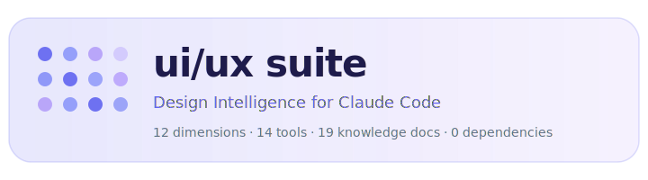
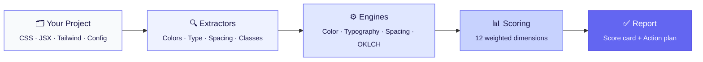

<picture>
  <source media="(prefers-color-scheme: dark)" srcset=".github/assets/logo-dark.svg">
  <source media="(prefers-color-scheme: light)" srcset=".github/assets/logo-light.svg">
  
</picture>

<p align="center">
  <a href="https://www.npmjs.com/package/ui-ux-suite"></a>
  <a href="LICENSE"></a>
  <a href="https://nodejs.org"></a>
  <a href="https://github.com/Aboudjem/ui-ux-suite/actions/workflows/ci.yml"></a>
  <a href="https://github.com/Aboudjem/ui-ux-suite/stargazers"></a>
</p>

<p align="center">
  <b>Your project's design quality, measured. Not guessed.</b><br/>
  <sub>Think ESLint, but for UI/UX. Backed by research, not opinions.</sub>
</p>

---

<br/>

## What is this?

You write code. You ship features. But how good does your UI *actually* look?

**ui/ux suite** is a Claude Code plugin that reads your real project files (CSS, JSX, Tailwind configs) and gives you a **quantified design score** across 12 dimensions. Not vibes. Not opinions. Numbers backed by accessibility standards, color science, and UX research.

```bash
claude plugin add github:Aboudjem/ui-ux-suite
```

That's it. No config. No dependencies. It just works.

<br/>

## See what you get

Run `/design-audit` and you'll see something like this:

<picture>
  <source media="(prefers-color-scheme: dark)" srcset=".github/assets/scorecard-dark.svg">
  <source media="(prefers-color-scheme: light)" srcset=".github/assets/scorecard-light.svg">
  
</picture>

Every score comes with **specific findings** and **concrete fixes**. Not vague advice like "improve your colors." You'll get things like:

> *"Button text contrast is 2.8:1, needs 4.5:1 for WCAG AA. Change `#94a3b8` to `#64748b` on your white background."*

<br/>

## How it works



Your code goes in. A score card with actionable fixes comes out. The suite auto-detects your framework, styling approach, and component library. You don't configure anything.

<br/>

## The 12 dimensions

Every project is scored across these axes, each weighted by impact on user experience:

| | Dimension | Weight | What we look at |
|:--|:----------|:------:|:----------------|
| 🎨 | **Color System** | 10% | Contrast ratios (WCAG + APCA), near duplicates, semantic roles, dark mode |
| 🔤 | **Typography** | 10% | Scale consistency, font count, body size, line height, fluid type |
| 📐 | **Layout & Spacing** | 10% | Spacing grid, breakpoints, container widths, consistency |
| 🧩 | **Component Quality** | 10% | State coverage (hover, focus, disabled, loading, error) |
| ♿ | **Accessibility** | 12% | Focus indicators, skip links, alt text, reduced motion, ARIA |
| 👁️ | **Visual Hierarchy** | 10% | Type scale, information priority, scannability |
| ✨ | **Interaction Quality** | 8% | Animation timing, easing, feedback, motion principles |
| 📱 | **Responsiveness** | 8% | Breakpoints, container queries, Tailwind responsive variants |
| 💎 | **Visual Polish** | 7% | Shadow quality, gradient animation, border radius tokens |
| ⚡ | **Performance UX** | 5% | Loading states, scroll driven animations, perceived speed |
| 🧭 | **Info Architecture** | 5% | Command palette, i18n, form validation, navigation |
| 🖥️ | **Platform Fit** | 5% | Dark mode toggle, component lib detection, a11y primitives |

> [!TIP]
> Accessibility gets the highest weight (12%) because it affects the most users. [5,114 ADA lawsuits were filed in H1 2025 alone](knowledge/evidence-base.md), up 37% year over year.

<br/>

## Why trust these scores?

Every recommendation links back to real research. Here are some of the findings baked into the scoring engine:

| What we found | Number | Source |
|:--------------|:------:|:-------|
| ⏱️ Time for users to form an opinion about your design | **50ms** | Academic research |
| 👋 Users who leave after encountering bad design | **88%** | UX survey |
| ⚖️ ADA lawsuits filed (H1 2025) | **5,114** | WebAIM, UsableNet |
| 🔍 Issues that automated a11y tools actually catch | **30-40%** | Deque, W3C |
| 🌙 Smartphone users with dark mode enabled | **81.9%** | Mobile analytics |
| 🧭 Task completion improvement from good navigation | **+37%** | UX study |
| ⏳ Abandonment reduction from skeleton loading | **-40%** | Product experiments |

<details>
<summary><b>📚 See all 30+ findings with confidence levels</b></summary>
<br/>

The full evidence base lives in [`knowledge/evidence-base.md`](knowledge/evidence-base.md). Every finding is rated **HIGH**, **MEDIUM**, or **LOW** confidence based on source quality and recency.

We don't make claims we can't back up.

</details>

<br/>

## Detects what others miss

The suite is aware of **2026 CSS features** that most tools don't even know about:

| Modern Feature | Detection | Why it matters |
|:---------------|:----------|:---------------|
| 🔄 View Transitions API | `@view-transition`, `::view-transition` | Native page transitions, no JS libraries needed |
| 📜 Scroll driven animations | `animation-timeline: view\|scroll` | 60fps on compositor thread, replaces GSAP |
| 📦 Container queries | `@container` | Component level responsiveness |
| 🎭 `@property` animations | `@property --*` | Animatable custom properties (gradients!) |
| 🌈 OKLCH color space | `oklch()` values | Perceptually uniform, better than HSL |
| 🌊 Tailwind v4 | `@import 'tailwindcss'`, `@theme` | Latest Tailwind architecture |

> [!NOTE]
> Most design linters are stuck in 2022. We score for the way modern CSS actually works in 2026, including features with 85-95%+ browser support that your project should be using.

<br/>

## 14 commands at your fingertips

<table>
<tr><td width="50%">

**🔍 Audit commands**

| Command | What it does |
|:--------|:------------|
| `/design-audit` | Full 12 dimension audit |
| `/design-score` | Quick overall score |
| `/color-audit` | Color system deep dive |
| `/type-audit` | Typography analysis |
| `/layout-audit` | Spacing & grid check |
| `/a11y-audit` | Accessibility review |
| `/component-audit` | State coverage check |

</td><td width="50%">

**🛠️ Generate & plan commands**

| Command | What it does |
|:--------|:------------|
| `/flow-audit` | Navigation & IA review |
| `/style-direction` | Style recommendation |
| `/design-tokens` | Generate token set |
| `/theme-builder` | Theme from brand color |
| `/refactor-plan` | Prioritized action plan |
| `/design-compare` | Before/after comparison |
| `/design-checklist` | Pre launch checklist |

</td></tr>
</table>

<br/>

## 12 specialized agents

The plugin dispatches specialized AI agents depending on what you're auditing:

```mermaid
graph TD
    A["🎯 design-auditor<br/><sub>Master orchestrator (Opus)</sub>"] --> B["🎨 color-analyst"]
    A --> C["🔤 typography-analyst"]
    A --> D["📐 layout-analyst"]
    A --> E["♿ accessibility-auditor"]
    A --> F["🧩 component-reviewer"]
    A --> G["✨ interaction-analyst"]
    A --> H["🧠 psychology-analyst"]
    A --> I["💎 visual-style-advisor"]
    A --> J["🖥️ platform-advisor"]
    A --> K["🧭 ux-flow-analyst"]
    A --> L["⚡ performance-ux-analyst"]

    style A fill:#6366f1,stroke:#4f46e5,color:#fff
    style B fill:#eef2ff,stroke:#6366f1,color:#1e1b4b
    style C fill:#eef2ff,stroke:#6366f1,color:#1e1b4b
    style D fill:#eef2ff,stroke:#6366f1,color:#1e1b4b
    style E fill:#eef2ff,stroke:#6366f1,color:#1e1b4b
    style F fill:#eef2ff,stroke:#6366f1,color:#1e1b4b
    style G fill:#eef2ff,stroke:#6366f1,color:#1e1b4b
    style H fill:#eef2ff,stroke:#6366f1,color:#1e1b4b
    style I fill:#eef2ff,stroke:#6366f1,color:#1e1b4b
    style J fill:#eef2ff,stroke:#6366f1,color:#1e1b4b
    style K fill:#eef2ff,stroke:#6366f1,color:#1e1b4b
    style L fill:#eef2ff,stroke:#6366f1,color:#1e1b4b
```



Each agent has deep domain knowledge. The `color-analyst` knows OKLCH math, the `accessibility-auditor` knows WCAG 2.2 + APCA, the `psychology-analyst` evaluates cognitive load. They don't just check rules, they understand *why* design decisions matter.

<br/>

## 📚 19 knowledge documents

The suite ships with **3,081 lines of curated design intelligence**. Not scraped content. Hand curated research from community scouts, academic papers, and practitioners at Vercel, Linear, Stripe, and Google.

<details>
<summary><b>Browse the knowledge base</b></summary>
<br/>

| Document | What's inside |
|:---------|:-------------|
| 📊 `evidence-base.md` | 30+ quantified findings with confidence levels |
| ♿ `accessibility-guide.md` | WCAG, ARIA, focus management, screen readers |
| 🎨 `color-theory.md` | Harmony, semantics, dark mode rules, product palettes |
| 🔤 `typography-theory.md` | Scale ratios, 2026 font picks, readability research |
| 🧩 `component-patterns.md` | State checklist, button hierarchy, form best practices |
| 🖥️ `platform-conventions.md` | iOS, Android, web platform specific patterns |
| 🧠 `psychology.md` | Cognitive load, Gestalt principles, trust signals |
| 📏 `principles.md` | Core design principles and heuristics |
| ⚠️ `anti-patterns.md` | Common mistakes and how to avoid them |
| 🚫 `dark-patterns.md` | Deceptive design detection and avoidance |
| 🧭 `ux-flows.md` | Navigation, onboarding, information architecture |
| 🔮 `trends-2026.md` | CSS features, AI patterns, style directions rated |
| ✨ `wow-libraries-2026.md` | 15 component libraries deep dived |
| 🎬 `wow-animations-2026.md` | Scroll driven, view transitions, modern motion |
| 🛠️ `design-tools-2026.md` | Design tooling landscape |
| 🤫 `insider-secrets-2026.md` | 35 tips from pros with 10+ years experience |
| 🏗️ `design-engineer-craft-2026.md` | Craft details from Vercel, Linear, shadcn engineers |
| 💎 `advanced-polish.md` | Shadow techniques, micro interactions, refinement |
| 📦 `libraries-tools.md` | Component library comparison guide |

</details>

<br/>

## Works with your stack

No config needed. The suite auto-detects everything from your `package.json` and source files.

<table>
<tr>
<td align="center" width="14%"><b>⚛️ React</b></td>
<td align="center" width="14%"><b>▲ Next.js</b></td>
<td align="center" width="14%"><b>💚 Vue</b></td>
<td align="center" width="14%"><b>🔶 Svelte</b></td>
<td align="center" width="14%"><b>🅰️ Angular</b></td>
<td align="center" width="14%"><b>🌐 Vanilla</b></td>
</tr>
<tr>
<td align="center">Tailwind</td>
<td align="center">CSS Modules</td>
<td align="center">SCSS</td>
<td align="center">styled-components</td>
<td align="center">CSS-in-JS</td>
<td align="center">Vanilla CSS</td>
</tr>
<tr>
<td align="center">shadcn/ui</td>
<td align="center">MUI</td>
<td align="center">Chakra</td>
<td align="center">Radix</td>
<td align="center">Mantine</td>
<td align="center">Headless UI</td>
</tr>
</table>

<br/>

## Zero dependencies. Seriously.

```
node_modules/  →  empty.
```

The entire suite is **2,934 lines of vanilla Node.js** using only built-in modules. That means:

| | Benefit |
|:--|:--------|
| ⚡ | **Instant install.** Nothing to download |
| 🔒 | **Zero supply chain risk.** Nothing to audit |
| 🧩 | **No version conflicts.** Nothing to break |
| 📦 | **Tiny footprint.** 112 KB packaged |

> [!IMPORTANT]
> This is a deliberate design choice. Color science (WCAG contrast, APCA, deltaE, OKLCH) is implemented from scratch. No external color libraries. Typography scale detection, spacing analysis, Tailwind parsing: all built in.

<br/>

## Quick start

| Step | Action |
|:----:|:-------|
| **1** | Install the plugin: `claude plugin add github:Aboudjem/ui-ux-suite` |
| **2** | Run your first audit: `/design-audit` |
| **3** | Read your score card and start fixing |

The audit produces a prioritized action plan. Quick wins first, major improvements last. Every finding tells you *what's wrong*, *why it matters*, and *exactly how to fix it*.

<br/>

## 🛠️ 14 MCP tools

<details>
<summary><b>For building custom workflows</b></summary>
<br/>

These tools are available for agents and custom automations:

| Tool | Purpose |
|:-----|:--------|
| `uiux_scan_project` | Detect framework, styling, component lib |
| `uiux_extract_colors` | Extract colors from CSS, Tailwind, tokens |
| `uiux_extract_typography` | Extract fonts, sizes, weights, line heights |
| `uiux_extract_spacing` | Extract padding, margin, gap values |
| `uiux_check_contrast` | WCAG 2.1 + APCA contrast for color pairs |
| `uiux_score_dimension` | Score a specific dimension (1 to 10) |
| `uiux_score_overall` | Calculate weighted overall score |
| `uiux_generate_palette` | Generate palette from brand color |
| `uiux_generate_type_scale` | Generate type scale (fixed or fluid) |
| `uiux_generate_spacing_scale` | Generate spacing scale from base unit |
| `uiux_generate_tokens` | Complete design token set |
| `uiux_knowledge_query` | Query the knowledge base |
| `uiux_audit_log` | Append finding to audit log |
| `uiux_audit_report` | Generate formatted report |

</details>

<br/>

## vs. alternatives

| | Manual review | Lighthouse | Stylelint | **ui/ux suite** |
|:--|:---:|:---:|:---:|:---:|
| Dimensions scored | subjective | 4 | rules based | **12** |
| Color science (APCA + OKLCH) | ❌ | ❌ | ❌ | ✅ |
| Typography scale detection | ❌ | ❌ | ❌ | ✅ |
| Accessibility (beyond axe) | manual | partial | ❌ | ✅ |
| Design token generation | ❌ | ❌ | ❌ | ✅ |
| 2026 CSS awareness | ❌ | ❌ | ❌ | ✅ |
| Framework auto detection | ❌ | ❌ | ❌ | ✅ |
| Knowledge base (3,081 lines) | your brain | ❌ | ❌ | ✅ |
| Evidence backed findings | depends | partially | ❌ | **30+ cited** |
| Dependencies | varies | 200+ | 50+ | **0** |

<br/>

## Contributing

We'd love your help. See [CONTRIBUTING.md](CONTRIBUTING.md) for the full guide.

**Good first contributions:**
- 📚 Add a knowledge document (with research citations)
- 🔧 Improve a framework extractor
- 🐛 Report a scoring edge case

> [!NOTE]
> The project is intentionally zero dependency. PRs that add npm packages will not be merged. All logic is implemented from scratch using Node.js built-ins.

<br/>

---

<p align="center">
  <a href="https://www.linkedin.com/in/adam-boudjemaa/"></a>
  <a href="https://x.com/AdamBoudj"></a>
  <a href="https://adam-boudjemaa.com/"></a>
</p>

<p align="center">
  <sub>Built by <a href="https://github.com/Aboudjem">Adam Boudjemaa</a> · MIT License · No telemetry · No data collection</sub>
</p>
