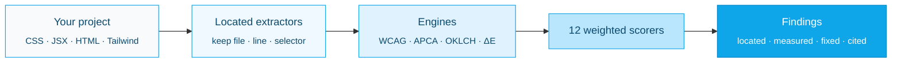

<picture>
  <source media="(prefers-color-scheme: dark)" srcset=".github/assets/logo-dark.svg">
  <source media="(prefers-color-scheme: light)" srcset=".github/assets/logo-light.svg">
  
</picture>

<p align="center">
  <a href="https://www.npmjs.com/package/ui-ux-suite"></a>
  <a href="LICENSE"></a>
  <a href="https://nodejs.org"></a>
  <a href="#zero-dependencies"></a>
  <a href="https://github.com/Aboudjem/ui-ux-suite/stargazers"></a>
</p>

<p align="center"><b>ESLint for design.</b> It finds the exact line, the measured wrong value, and the exact fix.</p>

<p align="center">
  <a href="#what-is-ui-ux-suite">What is it</a> ·
  <a href="#how-to-use-it-3-steps">How to use</a> ·
  <a href="#real-beforeafter">Before / after</a> ·
  <a href="#how-it-compares">Compare</a> ·
  <a href="#faq">FAQ</a>
</p>

---

## What is ui-ux-suite?

**ui-ux-suite is a zero-dependency design linter that audits your CSS, JSX, HTML, and Tailwind config and returns specific, located, measured findings with a concrete fix — not generic advice.**

Most "design review" tools tell you *"improve your contrast."* This tool tells you:

> `.hero-subtitle` at `src/styles.css:14`: text `#fbfbfb` on `#ffffff` = **1.03:1**, fails WCAG 2.2 AA (needs 4.5:1). Fix: change `color` to `#767676` (4.54:1 on white) or darker.

That is the whole point. Every finding is **located** (file:line + selector), **measured** (the real wrong number), and **fixed** (the exact change). It scores **12 design dimensions** grounded in **WCAG 2.2**, **APCA** contrast, and the **Laws of UX** — citing the WCAG success criterion or the named law it depends on.

- **It audits, it never edits.** Every run is read-only and outputs suggestions (`before` → `after`). Applying a fix is your call.
- **It runs anywhere.** One MCP server + one `npx` CLI → works in Claude Code, Cursor, VS Code, Codex, Gemini, Windsurf, and Continue.
- **It needs nothing.** Pure Node built-ins. No install weight, no API keys, no network, no telemetry. Your code stays on your machine.

<picture>
  <source media="(prefers-color-scheme: dark)" srcset=".github/assets/scorecard-dark.svg">
  <source media="(prefers-color-scheme: light)" srcset=".github/assets/scorecard-light.svg">
  
</picture>

---

## How to use it (3 steps)

### 1. Run it on any project

```bash
npx ui-ux-suite .
```

You get a ranked list of located + measured + fixed findings and a weighted 0–10 score across 12 dimensions. No config, no setup.

### 2. Pick the output you need

```bash
npx ui-ux-suite .                      # human-readable report (default)
npx ui-ux-suite . --json | jq          # machine-readable JSON (banner goes to stderr)
npx ui-ux-suite . --html report.html   # standalone dark-theme HTML report
npx ui-ux-suite . --fail-under 7        # exit 1 if the score drops below 7 (CI gate)
```

Exit codes: `0` ok · `1` audit error or below `--fail-under` · `2` path not found · `3` insufficient evidence.

### 3. Wire it into your AI editor (optional)

```bash
npx ui-ux-suite --mcp     # start the MCP server over stdio
```

Then ask your editor: *"Audit this project's design."* The MCP tool `uiux_audit_run` runs the same engine and returns the same located findings.

<details>
<summary><b>One-line MCP setup per editor</b></summary>

```bash
# Claude Code
claude mcp add ui-ux-suite npx ui-ux-suite --mcp

# Codex CLI
codex mcp add ui-ux-suite -- npx -y ui-ux-suite --mcp
```

**Cursor** — `~/.cursor/mcp.json`:
```json
{ "mcpServers": { "ui-ux-suite": { "command": "npx", "args": ["ui-ux-suite", "--mcp"] } } }
```

**VS Code + Copilot** — `.vscode/mcp.json`:
```json
{ "servers": { "ui-ux-suite": { "command": "npx", "args": ["-y", "ui-ux-suite", "--mcp"] } } }
```

**Gemini CLI** — `~/.gemini/mcp_config.json`:
```json
{ "mcpServers": { "ui-ux-suite": { "command": "npx", "args": ["ui-ux-suite", "--mcp"] } } }
```

**Windsurf** — `~/.codeium/windsurf/mcp_config.json`:
```json
{ "mcpServers": { "ui-ux-suite": { "command": "npx", "args": ["ui-ux-suite", "--mcp"] } } }
```

**Continue.dev** — `.continue/mcpServers/ui-ux-suite.yaml`:
```yaml
mcpServers:
  ui-ux-suite: { command: npx, args: [ui-ux-suite, --mcp], type: stdio }
```

</details>

<details>
<summary><b>Install as a Claude Code plugin</b></summary>

```bash
# From the 10x marketplace
claude plugin marketplace add Aboudjem/10x
claude plugin install ui-ux-suite@10x

# Or directly from this repo (ships its own marketplace.json)
claude plugin marketplace add Aboudjem/ui-ux-suite
claude plugin install ui-ux-suite@ui-ux-suite
```

Wires up the slash commands, specialist agents, knowledge base, and the MCP server in one step.
</details>

<details>
<summary><b>Install as a dev dependency</b></summary>

```bash
npm install -D ui-ux-suite
```

```json
{ "scripts": { "design-audit": "ui-ux-suite . --fail-under 7" } }
```

Requires Node 18+.
</details>

---

## Real before / after

The repo ships a fixture with **12 deliberately planted UX problems** and their ground truth (`test/fixtures/planted-ux-problems/PLANTED.md`). It is the regression gate for every release.

The thing that changed in this rebuild is **specificity** — whether a finding is detected **and** located **and** measured **and** fixed:

| | Detected | Located (`file:line`) | Measured (real value) | Fixed (`before`→`after`) | Specificity |
|:--|:--:|:--:|:--:|:--:|:--:|
| **Before (v0.3 baseline)** | partial | ✗ | ✗ | ✗ | **0 / 12** |
| **After (v0.4)** | ✓ | ✓ | ✓ | ✓ | **12 / 12** |

The old engine concatenated every CSS file into one blob and emitted bare `{severity, msg}` strings — file identity died before scoring, so it could never point at a line. The new engine carries `{value, file, line, col, selector}` from the extractor all the way to the finding.

**A real finding from that fixture** (verbatim from `npx ui-ux-suite test/fixtures/planted-ux-problems`):

```
Low text contrast on `.hero-subtitle` — 1.03:1
  src/styles.css:14   ·   WCAG 1.4.3 Contrast (Minimum) (AA)
  measured: 1.03:1 (APCA Lc 0)
  fix: change color on `.hero-subtitle` from #fbfbfb to #767676
       (meets 4.5:1 on #ffffff), or darken further.
```

That fixture currently scores **3.8 / 10 ("Needs Work")** — because it is supposed to be broken. Run it yourself:

```bash
npx ui-ux-suite test/fixtures/planted-ux-problems
```

---

## How it compares

The differentiator is **located + measured + fixed, with a WCAG SC or UX-law citation, from your source *or* a URL** — in one zero-dep command across every editor.

| | ui-ux-suite | Lighthouse | axe-core | CSS / design linters |
|:--|:--:|:--:|:--:|:--:|
| Points at the exact `file:line` + selector | ✓ | ✗ (URL only) | ✗ (DOM node only) | ✓ (lint rules) |
| Reports the **measured wrong value** | ✓ | partial | ✓ (contrast) | ✗ |
| Gives a concrete `before` → `after` fix | ✓ | ✗ | ✗ | partial (autofix) |
| Cites WCAG 2.2 **and** APCA | ✓ | WCAG only | WCAG only | ✗ |
| Cites named **Laws of UX** (Hick, Fitts, Miller…) | ✓ | ✗ | ✗ | ✗ |
| Works on **static source** (no running URL) | ✓ | ✗ (needs URL) | ✗ (needs DOM) | ✓ |
| Works on a **running URL** (deep mode) | ✓ (opt-in) | ✓ | ✓ | ✗ |
| Covers **12 design dimensions** (beyond a11y) | ✓ | partial | a11y only | per-rule |
| Zero runtime dependencies | ✓ | ✗ | ✗ | ✗ |

ui-ux-suite does not replace Lighthouse or axe — it covers the gap they leave: design quality grounded in your **source**, with a fix you can paste.

---

## What it scores

12 weighted dimensions. Accessibility carries the most weight because it affects the most users.

| Dimension | Weight | Checks |
|:----------|:------:|:-------|
| Accessibility | 12% | Focus visible, alt text, labels, target size, reduced motion |
| Color System | 10% | WCAG + APCA contrast, duplicate hues, semantic roles, dark mode |
| Typography | 10% | Scale consistency, font count, body size, line height |
| Layout & Spacing | 10% | Grid, off-scale values, breakpoints, container widths |
| Component Quality | 10% | States: hover, focus, disabled, loading, error |
| Visual Hierarchy | 10% | Type scale, information priority, scannability |
| Interaction | 8% | Animation timing, easing, feedback |
| Responsiveness | 8% | Breakpoints, container queries, viewport meta |
| Visual Polish | 7% | Shadow quality, radius tokens, off-scale arbitrary values |
| Performance UX | 5% | Loading states, perceived speed |
| Info Architecture | 5% | Validation, navigation, command palette |
| Platform Fit | 5% | Dark mode, component lib, a11y primitives |

---

## How it works


```mermaid
graph LR
    A["Your project<br/><sub>CSS · JSX · HTML · Tailwind</sub>"] --> B["Located extractors<br/><sub>keep file · line · selector</sub>"]
    B --> C["Engines<br/><sub>WCAG · APCA · OKLCH · ΔE</sub>"]
    C --> D["12 weighted scorers"]
    D --> E["Findings<br/><sub>located · measured · fixed · cited</sub>"]
    style A fill:#f8fafc,stroke:#0ea5e9,color:#0c4a6e
    style B fill:#f0f9ff,stroke:#0ea5e9,color:#0c4a6e
    style C fill:#e0f2fe,stroke:#0ea5e9,color:#0c4a6e
    style D fill:#bae6fd,stroke:#0ea5e9,color:#0c4a6e
    style E fill:#0ea5e9,stroke:#0284c7,color:#ffffff
```

Static analysis is the default and the primary deliverable — it needs no browser. **Deep mode** is opt-in: install the optional peer deps (`playwright-core`, `@axe-core/playwright`) and pass a `baseUrl` to also measure live contrast, flag touch targets under 44×44px, and screenshot routes. When the deps are absent, it degrades gracefully to source-based findings.

<details>
<summary><b>The 16 MCP tools</b></summary>

| Tool | What it does |
|:-----|:-------------|
| `uiux_audit_run` | **One-call full audit.** Scan → extract → score 12 dimensions → located findings. Supports `depth: quick\|deep`, `dimensions`, `baseUrl`, `format`. |
| `uiux_scan_project` | Detect framework, styling (Tailwind v3 vs v4), component/theme/icon libs. |
| `uiux_extract_colors` / `uiux_extract_typography` / `uiux_extract_spacing` | Pull values **with** file/line/selector. |
| `uiux_check_contrast` | WCAG 2.2 + APCA contrast for any pair. |
| `uiux_score_dimension` / `uiux_score_overall` | Score one of 12 dimensions, or the weighted total. |
| `uiux_generate_palette` / `uiux_generate_type_scale` / `uiux_generate_spacing_scale` / `uiux_generate_tokens` | OKLCH-based token generators. |
| `uiux_knowledge_query` / `uiux_laws_query` | Query the knowledge base and the Laws of UX. |
| `uiux_audit_log` / `uiux_audit_report` | Append a finding · render a report. |

</details>

<details>
<summary><b>Slash commands (Claude Code)</b></summary>

```
/ui-ux-suite:audit          Full 12-dimension audit, one report
/ui-ux-suite:colors         Color-only audit
/ui-ux-suite:a11y [--deep]  Accessibility audit (Playwright + axe-core in deep mode)
/ui-ux-suite:typography     Typography and hierarchy audit
/ui-ux-suite:components     Component-quality audit
```

Plus 14 specialist `/design-*`, `/color-audit`, `/a11y-audit`, … commands and 12 specialist agents.
</details>

---

## FAQ

**Is it safe to run on my project?**
Yes. Every audit is strictly read-only. The tool never creates, edits, or deletes files in the project you audit — it only reads and reports. Deep-mode screenshots happen in a throwaway browser page, never against your source.

**Does my code leave my machine?**
No. All analysis runs locally with Node built-ins. No network calls, no API keys, no telemetry.

**Which frameworks does it support?**
React, Next.js, Vue, Svelte, Angular, and vanilla. Styling: Tailwind (v3 and v4 `@theme`), CSS Modules, SCSS, styled-components, Emotion, vanilla-extract, plain CSS. It auto-detects the stack; no config.

**<a id="zero-dependencies"></a>Is it really zero-dependency?**
Yes — the runtime uses only Node built-ins. `playwright-core` and `@axe-core/playwright` are **optional** peer deps for deep mode only; the default install pulls nothing.

**Do I need a running app?**
No. Source-based findings are the default. A running URL plus deep mode is a bonus, not a requirement.

**Does it fix my code automatically?**
No. It audits and *suggests* (`before` → `after`). Applying a fix is a separate, deliberate step you take.

**Can I use it in CI?**
Yes. `npx ui-ux-suite . --fail-under 7` exits non-zero when the score drops below your threshold. `--json` gives machine-readable output for any pipeline.

---

## Why trust it

- **Real color science.** Contrast is computed with the tool's own WCAG 2.2 and APCA math, not estimated. The fixture's measured ratios (e.g. `1.03:1`) are reproducible from `lib/color-engine.js`.
- **Cited WCAG success criteria.** Accessibility findings cite the exact SC — `1.4.3` Contrast (Minimum), `1.4.11` Non-text Contrast, `2.5.8` Target Size, `2.4.7` Focus Visible, `1.1.1` Non-text Content, `3.3.2` Labels or Instructions.
- **Verified Laws of UX.** UX findings cite a named law from a primary-source allow-list, each linking to its canonical [lawsofux.com](https://lawsofux.com/) page (e.g. Hick's Law, Fitts's Law, Law of Prägnanz). A wrong citation is treated as worse than none, so the citation set is pinned by a test.
- **A regression gate, not a vibe.** The 12-problem fixture asserts every finding carries `evidence.file`, `evidence.line`, and a `fix`. If specificity regresses, the test suite fails.

---

## Privacy

All analysis runs locally. Your code never leaves your machine. No telemetry, no API calls, no network.

---

## Contributing

Contributions welcome. The project is maintained in public.

```bash
git clone https://github.com/Aboudjem/ui-ux-suite
cd ui-ux-suite
npm test
```

- **Bug fixes** should include a test that would have caught the bug.
- **New scoring rules** must cite a WCAG SC or a named UX law from the allow-list and emit a `createFinding(...)` with `evidence: {file, line, selector, measured, threshold}` plus a `fix`.
- **No new runtime dependencies** — the suite is zero-dep by design.
- **No em-dashes** in user-facing copy.

See [CONTRIBUTING.md](CONTRIBUTING.md), [AGENTS.md](AGENTS.md), [CODE_OF_CONDUCT.md](CODE_OF_CONDUCT.md), and [SECURITY.md](SECURITY.md).

---

<p align="center">
  <a href="https://www.linkedin.com/in/adam-boudjemaa/"></a>
  <a href="https://x.com/AdamBoudj"></a>
  <a href="https://adam-boudjemaa.com/"></a>
</p>

<p align="center"><sub>MIT · Built by <a href="https://github.com/Aboudjem">Adam Boudjemaa</a> · Star ⭐ to help others find it</sub></p>
