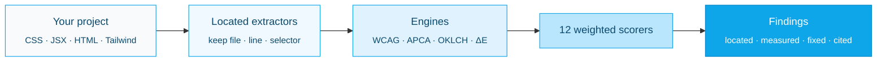

<picture>
  <source media="(prefers-color-scheme: dark)" srcset=".github/assets/logo-dark.svg">
  <source media="(prefers-color-scheme: light)" srcset=".github/assets/logo-light.svg">
  
</picture>

<p align="center">
  <a href="https://github.com/Aboudjem/ui-ux-suite/actions/workflows/ci.yml"></a>
  <a href="https://www.npmjs.com/package/ui-ux-suite"></a>
  <a href="LICENSE"></a>
  <a href="#real-tests"></a>
  <a href="https://nodejs.org"></a>
  <a href="#zero-dependencies"></a>
  <a href="https://github.com/Aboudjem/ui-ux-suite/stargazers"></a>
</p>

<p align="center">
  <a href="../README.md">English</a> ·
  <a href="zh-CN.md">简体中文</a> ·
  <a href="ja.md">日本語</a> ·
  <b>Español</b> ·
  <a href="fr.md">Français</a>
</p>

<p align="center"><b>ESLint para el diseño.</b> Encuentra la línea exacta, el valor incorrecto medido y la corrección exacta.</p>

<p align="center">
  <a href="#what-is-ui-ux-suite">Qué es</a> ·
  <a href="#how-to-use-it-3-steps">Cómo se usa</a> ·
  <a href="#real-beforeafter">Antes / después</a> ·
  <a href="#how-it-compares">Comparativa</a> ·
  <a href="#faq">Preguntas frecuentes</a>
</p>

---


---

## ¿Qué es ui-ux-suite?

**ui-ux-suite es un linter de diseño sin dependencias que audita tu CSS, JSX, HTML y la configuración de Tailwind, y devuelve hallazgos específicos, localizados y medidos, con una corrección concreta, no consejos genéricos.**

La mayoría de las herramientas de "revisión de diseño" te dicen *"mejora tu contraste"*. Esta herramienta te dice:

> `.hero-subtitle` en `src/styles.css:14`: el texto `#fbfbfb` sobre `#ffffff` = **1.03:1**, no cumple WCAG 2.2 AA (necesita 4.5:1). Corrección: cambia `color` a `#767676` (4.54:1 sobre blanco) o más oscuro.

Ese es justamente el punto. Cada hallazgo está **localizado** (file:line + selector), **medido** (el valor incorrecto real) y **corregido** (el cambio exacto). Puntúa **12 dimensiones de diseño** fundamentadas en **WCAG 2.2**, el contraste **APCA** y las **Leyes de UX**, citando el criterio de éxito de WCAG o la ley con nombre de la que depende.

- **Audita, nunca edita.** Cada ejecución es de solo lectura y produce sugerencias (`before` → `after`). Aplicar una corrección es decisión tuya.
- **Se ejecuta en cualquier lugar.** Un servidor MCP + una CLI `npx` → funciona en Claude Code, Cursor, VS Code, Codex, Gemini, Windsurf y Continue.
- **No necesita nada.** Solo módulos integrados de Node. Sin peso de instalación, sin claves de API, sin red, sin telemetría. Tu código se queda en tu máquina.

**Mira una ejecución real:** [informe de auditoría de ejemplo](docs/demo/sample-audit.html) · [salida de terminal de ejemplo](docs/demo/sample-run.txt)

<picture>
  <source media="(prefers-color-scheme: dark)" srcset=".github/assets/scorecard-dark.svg">
  <source media="(prefers-color-scheme: light)" srcset=".github/assets/scorecard-light.svg">
  
</picture>

---

## Cómo se usa (3 pasos)

### 1. Ejecútalo en cualquier proyecto

```bash
npx ui-ux-suite .
```

Obtienes una lista ordenada de hallazgos localizados + medidos + corregidos y una puntuación ponderada de 0–10 en 12 dimensiones. Sin configuración, sin instalación.

### 2. Elige la salida que necesitas

```bash
npx ui-ux-suite .                      # human-readable report (default)
npx ui-ux-suite . --json | jq          # machine-readable JSON (banner goes to stderr)
npx ui-ux-suite . --html report.html   # standalone dark-theme HTML report
npx ui-ux-suite . --fail-under 7        # exit 1 if the score drops below 7 (CI gate)
```

Códigos de salida: `0` ok · `1` error de auditoría o por debajo de `--fail-under` · `2` ruta no encontrada · `3` evidencia insuficiente.

### 3. Conéctalo a tu editor con IA (opcional)

```bash
npx ui-ux-suite --mcp     # start the MCP server over stdio
```

Luego pídele a tu editor: *"Audita el diseño de este proyecto."* La herramienta MCP `uiux_audit_run` ejecuta el mismo motor y devuelve los mismos hallazgos localizados.

<details>
<summary><b>Configuración MCP de una línea por editor</b></summary>

```bash
# Claude Code
claude mcp add ui-ux-suite npx ui-ux-suite --mcp

# Codex CLI
codex mcp add ui-ux-suite -- npx -y ui-ux-suite --mcp
```

**Cursor** (`~/.cursor/mcp.json`):
```json
{ "mcpServers": { "ui-ux-suite": { "command": "npx", "args": ["ui-ux-suite", "--mcp"] } } }
```

**VS Code + Copilot** (`.vscode/mcp.json`):
```json
{ "servers": { "ui-ux-suite": { "command": "npx", "args": ["-y", "ui-ux-suite", "--mcp"] } } }
```

**Gemini CLI** (`~/.gemini/mcp_config.json`):
```json
{ "mcpServers": { "ui-ux-suite": { "command": "npx", "args": ["ui-ux-suite", "--mcp"] } } }
```

**Windsurf** (`~/.codeium/windsurf/mcp_config.json`):
```json
{ "mcpServers": { "ui-ux-suite": { "command": "npx", "args": ["ui-ux-suite", "--mcp"] } } }
```

**Continue.dev** (`.continue/mcpServers/ui-ux-suite.yaml`):
```yaml
mcpServers:
  ui-ux-suite: { command: npx, args: [ui-ux-suite, --mcp], type: stdio }
```

</details>

### O instala las skills en cualquier CLI de IA

El servidor MCP de arriba funciona en todos los clientes compatibles con MCP. Para cargar también las skills `/design-*` directamente en otra CLI, ejecuta el instalador de una línea. Crea enlaces simbólicos de las skills en el directorio de skills de esa CLI; `--update` obtiene la última versión y vuelve a enlazar, `--uninstall` las elimina.

```bash
curl -fsSL https://raw.githubusercontent.com/Aboudjem/ui-ux-suite/main/install.sh | bash -s codex
```

En Windows, ejecuta `install.ps1 <platform>` desde un checkout (se necesita el Modo de desarrollador o una shell con privilegios elevados para los enlaces simbólicos).

| Plataforma | Directorio de skills | Una línea |
|:--|:--|:--|
| Claude Code | (plugin) | `claude plugin install ui-ux-suite@10x` |
| Codex / Gemini / OpenCode / Pi | `~/.agents/skills` | `install.sh codex` |
| VS Code (Copilot) | `~/.copilot/skills` | `install.sh copilot` |
| Trae | `~/.trae/skills` | `install.sh trae` |
| Vibe | `~/.vibe/skills` | `install.sh vibe` |
| OpenClaw | `~/.openclaw/skills` | `install.sh openclaw` |
| Antigravity | `~/.gemini/antigravity/skills` | `install.sh antigravity` |
| Hermes / Cline / Kimi | `~/.<cli>/skills` | `install.sh hermes` |

Las convenciones de los directorios de skills cambian entre versiones de las CLI. Si un enlace no se resuelve, recurre al servidor MCP (funciona en todas partes). Ejecuta `install.sh all` para enlazar todas las plataformas a la vez.

<details>
<summary><b>Instalar como plugin de Claude Code</b></summary>

```bash
# From the 10x marketplace
claude plugin marketplace add Aboudjem/10x
claude plugin install ui-ux-suite@10x
```

Configura los comandos de barra, los agentes especialistas, la base de conocimiento y el servidor MCP en un solo paso.
</details>

<details>
<summary><b>Instalar como dependencia de desarrollo</b></summary>

```bash
npm install -D ui-ux-suite
```

```json
{ "scripts": { "design-audit": "ui-ux-suite . --fail-under 7" } }
```

Requiere Node 18+.
</details>

---

## Antes / después real

El repositorio incluye un fixture con **12 problemas de UX plantados deliberadamente** y su verdad de referencia (`test/fixtures/planted-ux-problems/PLANTED.md`). Es la puerta de regresión de cada versión.

Lo que cambió en esta reconstrucción es la **especificidad**: si un hallazgo se detecta **y** se localiza **y** se mide **y** se corrige:

| | Detectado | Localizado (`file:line`) | Medido (valor real) | Corregido (`before`→`after`) | Especificidad |
|:--|:--:|:--:|:--:|:--:|:--:|
| **Antes (línea base v0.3)** | parcial | ✗ | ✗ | ✗ | **0 / 12** |
| **Después (v0.4)** | ✓ | ✓ | ✓ | ✓ | **12 / 12** |

El motor antiguo concatenaba cada archivo CSS en un solo bloque y emitía cadenas `{severity, msg}` sin más; la identidad del archivo se perdía antes de la puntuación, así que nunca podía señalar una línea. El nuevo motor lleva `{value, file, line, col, selector}` desde el extractor hasta el hallazgo.

**Un hallazgo real de ese fixture** (textual de `npx ui-ux-suite test/fixtures/planted-ux-problems`):

```
Low text contrast on `.hero-subtitle`: 1.03:1
  src/styles.css:14   ·   WCAG 1.4.3 Contrast (Minimum) (AA)
  measured: 1.03:1 (APCA Lc 0)
  fix: change color on `.hero-subtitle` from #fbfbfb to #767676
       (meets 4.5:1 on #ffffff), or darken further.
```

Ese fixture obtiene actualmente **3.8 / 10 ("Necesita trabajo")**, porque se supone que está roto. Ejecútalo tú mismo:

```bash
npx ui-ux-suite test/fixtures/planted-ux-problems
```

---

## Cómo se compara

El factor diferenciador es **localizado + medido + corregido, con una cita de un SC de WCAG o de una ley de UX, desde tu código fuente *o* una URL**, en un único comando sin dependencias y en todos los editores.

| | ui-ux-suite | Lighthouse | axe-core | Linters de CSS / diseño |
|:--|:--:|:--:|:--:|:--:|
| Señala el `file:line` + selector exacto | ✓ | ✗ (solo URL) | ✗ (solo nodo del DOM) | ✓ (reglas de lint) |
| Reporta el **valor incorrecto medido** | ✓ | parcial | ✓ (contraste) | ✗ |
| Da una corrección concreta `before` → `after` | ✓ | ✗ | ✗ | parcial (autofix) |
| Cita WCAG 2.2 **y** APCA | ✓ | solo WCAG | solo WCAG | ✗ |
| Cita **Leyes de UX** con nombre (Hick, Fitts, Miller…) | ✓ | ✗ | ✗ | ✗ |
| Funciona sobre **código fuente estático** (sin URL en ejecución) | ✓ | ✗ (necesita URL) | ✗ (necesita DOM) | ✓ |
| Funciona sobre una **URL en ejecución** (modo profundo) | ✓ (opcional) | ✓ | ✓ | ✗ |
| Cubre **12 dimensiones de diseño** (más allá de la a11y) | ✓ | parcial | solo a11y | por regla |
| Cero dependencias en tiempo de ejecución | ✓ | ✗ | ✗ | ✗ |

ui-ux-suite no reemplaza a Lighthouse ni a axe. Cubre el hueco que ellos dejan: calidad de diseño fundamentada en tu **código fuente**, con una corrección que puedes pegar.

---

## Qué puntúa

12 dimensiones ponderadas. La accesibilidad tiene el mayor peso porque afecta a más usuarios.

| Dimensión | Peso | Comprobaciones |
|:----------|:------:|:-------|
| Accesibilidad | 12% | Foco visible, texto alternativo, etiquetas, tamaño de objetivo, movimiento reducido |
| Sistema de color | 10% | Contraste WCAG + APCA, tonos duplicados, roles semánticos, modo oscuro |
| Sistema tipográfico | 10% | Consistencia de escala, número de fuentes, tamaño del cuerpo, altura de línea |
| Diseño y espaciado | 10% | Cuadrícula, valores fuera de escala, breakpoints, anchos de contenedor |
| Calidad de componentes | 10% | Estados: hover, foco, deshabilitado, cargando, error |
| Jerarquía visual | 10% | Escala tipográfica, prioridad de información, escaneabilidad |
| Calidad de interacción | 8% | Tiempos de animación, easing, retroalimentación |
| Responsividad | 8% | Breakpoints, container queries, meta viewport |
| Pulido visual | 7% | Calidad de sombras, tokens de radio, valores arbitrarios fuera de escala |
| UX de rendimiento | 5% | Estados de carga, velocidad percibida |
| Arquitectura de la información | 5% | Validación, navegación, paleta de comandos |
| Adecuación a la plataforma | 5% | Modo oscuro, librería de componentes, primitivas de a11y |

---

## Cómo funciona



El análisis estático es el modo por defecto y el entregable principal; no necesita navegador. El **modo profundo** es opcional: instala las peer deps opcionales (`playwright-core`, `@axe-core/playwright`) y pasa un `baseUrl` para medir también el contraste en vivo, marcar objetivos táctiles por debajo de 44×44px y capturar pantallas de las rutas. Cuando las dependencias no están presentes, degrada con elegancia a hallazgos basados en el código fuente.

<details>
<summary><b>Las 16 herramientas MCP</b></summary>

| Herramienta | Qué hace |
|:-----|:-------------|
| `uiux_audit_run` | **Auditoría completa en una sola llamada.** Escanea → extrae → puntúa 12 dimensiones → hallazgos localizados. Admite `depth: quick\|deep`, `dimensions`, `baseUrl`, `format`. |
| `uiux_scan_project` | Detecta el framework, el estilo (Tailwind v3 vs v4), las librerías de componentes/tema/iconos. |
| `uiux_extract_colors` / `uiux_extract_typography` / `uiux_extract_spacing` | Extrae valores **con** file/line/selector. |
| `uiux_check_contrast` | Contraste WCAG 2.2 + APCA para cualquier par. |
| `uiux_score_dimension` / `uiux_score_overall` | Puntúa una de las 12 dimensiones o el total ponderado. |
| `uiux_generate_palette` / `uiux_generate_type_scale` / `uiux_generate_spacing_scale` / `uiux_generate_tokens` | Generadores de tokens basados en OKLCH. |
| `uiux_knowledge_query` / `uiux_laws_query` | Consulta la base de conocimiento y las Leyes de UX. |
| `uiux_audit_log` / `uiux_audit_report` | Añade un hallazgo · renderiza un informe. |

</details>

<details>
<summary><b>Comandos de barra (Claude Code)</b></summary>

```
/ui-ux-suite:audit          Full 12-dimension audit, one report
/ui-ux-suite:colors         Color-only audit
/ui-ux-suite:a11y [--deep]  Accessibility audit (Playwright + axe-core in deep mode)
/ui-ux-suite:typography     Typography and hierarchy audit
/ui-ux-suite:components     Component-quality audit
```

Más 14 comandos especialistas `/design-*`, `/color-audit`, `/a11y-audit`, … y 12 agentes especialistas.
</details>

---

## Preguntas frecuentes

**¿Es seguro ejecutarlo en mi proyecto?**
Sí. Cada auditoría es estrictamente de solo lectura. La herramienta nunca crea, edita ni elimina archivos en el proyecto que auditas; solo lee e informa. Las capturas del modo profundo ocurren en una página de navegador desechable, nunca contra tu código fuente.

**¿Mi código sale de mi máquina?**
No. Todo el análisis se ejecuta localmente con módulos integrados de Node. Sin llamadas de red, sin claves de API, sin telemetría.

**¿Qué frameworks soporta?**
React, Next.js, Vue, Svelte, Angular y vanilla. Estilos: Tailwind (v3 y v4 `@theme`), CSS Modules, SCSS, styled-components, Emotion, vanilla-extract, CSS plano. Detecta el stack automáticamente; sin configuración.

**<a id="zero-dependencies"></a>¿De verdad es sin dependencias?**
Sí. El runtime usa solo módulos integrados de Node. `playwright-core` y `@axe-core/playwright` son peer deps **opcionales** solo para el modo profundo; la instalación por defecto no trae nada.

**¿Necesito una app en ejecución?**
No. Los hallazgos basados en el código fuente son el modo por defecto. Una URL en ejecución más el modo profundo es un extra, no un requisito.

**¿Corrige mi código automáticamente?**
No. Audita y *sugiere* (`before` → `after`). Aplicar una corrección es un paso aparte y deliberado que das tú.

**¿Puedo usarlo en CI?**
Sí. `npx ui-ux-suite . --fail-under 7` sale con un código distinto de cero cuando la puntuación cae por debajo de tu umbral. `--json` da una salida legible por máquina para cualquier pipeline.

---

## Por qué confiar en él

- **Ciencia del color real.** El contraste se calcula con las propias matemáticas WCAG 2.2 y APCA de la herramienta, no se estima. Las proporciones medidas del fixture (p. ej. `1.03:1`) son reproducibles desde `lib/color-engine.js`.
- **Criterios de éxito de WCAG citados.** Los hallazgos de accesibilidad citan el SC exacto: `1.4.3` Contraste (mínimo), `1.4.11` Contraste no textual, `2.5.8` Tamaño del objetivo, `2.4.7` Foco visible, `1.1.1` Contenido no textual, `3.3.2` Etiquetas o instrucciones.
- **Leyes de UX verificadas.** Los hallazgos de UX citan una ley con nombre de una lista permitida de fuentes primarias, cada una enlazando a su página canónica en [lawsofux.com](https://lawsofux.com/) (p. ej. Ley de Hick, Ley de Fitts, Ley de Prägnanz). Una cita errónea se considera peor que ninguna, así que el conjunto de citas está fijado por una prueba.
- <a id="real-tests"></a>**Una puerta de regresión, no una intuición.** **311 pruebas** (ejecuta `npm test`) afirman comportamiento real, incluido un fixture de 12 problemas donde cada hallazgo debe llevar `evidence.file`, `evidence.line` y un `fix`. Si la especificidad retrocede, la suite de pruebas falla.

---

## Privacidad

Todo el análisis se ejecuta localmente. Tu código nunca sale de tu máquina. Sin telemetría, sin llamadas de API, sin red.

---

## Historial de Stars

<a href="https://star-history.com/#Aboudjem/ui-ux-suite&Date">
  <picture>
    <source media="(prefers-color-scheme: dark)" srcset="https://api.star-history.com/svg?repos=Aboudjem/ui-ux-suite&type=Date&theme=dark" />
    <source media="(prefers-color-scheme: light)" srcset="https://api.star-history.com/svg?repos=Aboudjem/ui-ux-suite&type=Date" />
    
  </picture>
</a>

---

## Contribuir

Issues y PRs bienvenidos. El proyecto se mantiene en público.

```bash
git clone https://github.com/Aboudjem/ui-ux-suite
cd ui-ux-suite
npm test
```

- Las **correcciones de errores** deben incluir una prueba que habría detectado el error.
- Las **nuevas reglas de puntuación** deben citar un SC de WCAG o una ley de UX con nombre de la lista permitida y emitir un `createFinding(...)` con `evidence: {file, line, selector, measured, threshold}` más un `fix`.
- **Sin nuevas dependencias en tiempo de ejecución.** La suite es sin dependencias por diseño.
- **Sin guiones largos (em-dash)** en el texto orientado al usuario.

Consulta [CONTRIBUTING.md](CONTRIBUTING.md), [AGENTS.md](AGENTS.md), [CODE_OF_CONDUCT.md](CODE_OF_CONDUCT.md) y [SECURITY.md](SECURITY.md).

---

<p align="center">
  <a href="https://www.linkedin.com/in/adam-boudjemaa/"></a>
  <a href="https://x.com/AdamBoudj"></a>
  <a href="https://adam-boudjemaa.com/"></a>
</p>

<p align="center"><sub>MIT · Creado por <a href="https://github.com/Aboudjem">Adam Boudjemaa</a> · Dale una Star ⭐ para ayudar a que otros lo encuentren</sub></p>

> Esta traducción es asistida por máquina. Se agradecen las correcciones de hablantes nativos tomando como referencia el README en inglés.
