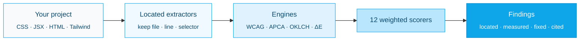

<picture>
  <source media="(prefers-color-scheme: dark)" srcset=".github/assets/logo-dark.svg">
  <source media="(prefers-color-scheme: light)" srcset=".github/assets/logo-light.svg">
  
</picture>

<p align="center">
  <a href="https://github.com/Aboudjem/ui-ux-suite/actions/workflows/ci.yml"></a>
  <a href="https://www.npmjs.com/package/ui-ux-suite"></a>
  <a href="LICENSE"></a>
  <a href="#real-tests"></a>
  <a href="https://nodejs.org"></a>
  <a href="#zero-dependencies"></a>
  <a href="https://github.com/Aboudjem/ui-ux-suite/stargazers"></a>
</p>

<p align="center">
  <a href="../README.md">English</a> ·
  <a href="zh-CN.md">简体中文</a> ·
  <a href="ja.md">日本語</a> ·
  <a href="es.md">Español</a> ·
  <b>Français</b>
</p>

<p align="center"><b>ESLint pour le design.</b> Il trouve la ligne exacte, la valeur erronée mesurée et le correctif exact.</p>

<p align="center">
  <a href="#what-is-ui-ux-suite">Qu'est-ce que c'est</a> ·
  <a href="#how-to-use-it-3-steps">Comment l'utiliser</a> ·
  <a href="#real-beforeafter">Avant / après</a> ·
  <a href="#how-it-compares">Comparatif</a> ·
  <a href="#faq">FAQ</a>
</p>

---


---

## Qu'est-ce que ui-ux-suite ?

**ui-ux-suite est un linter de design sans dépendances qui audite votre CSS, JSX, HTML et la configuration Tailwind, et renvoie des constats spécifiques, localisés et mesurés, accompagnés d'un correctif concret, et non de conseils génériques.**

La plupart des outils de « revue de design » vous disent *« améliorez votre contraste »*. Cet outil vous dit :

> `.hero-subtitle` à `src/styles.css:14` : le texte `#fbfbfb` sur `#ffffff` = **1.03:1**, échoue à WCAG 2.2 AA (4.5:1 requis). Correctif : changez `color` en `#767676` (4.54:1 sur blanc) ou plus foncé.

C'est tout l'enjeu. Chaque constat est **localisé** (file:line + sélecteur), **mesuré** (la vraie valeur erronée) et **corrigé** (le changement exact). Il note **12 dimensions de design** fondées sur **WCAG 2.2**, le contraste **APCA** et les **Lois de l'UX**, en citant le critère de succès WCAG ou la loi nommée dont il dépend.

- **Il audite, il n'édite jamais.** Chaque exécution est en lecture seule et produit des suggestions (`before` → `after`). Appliquer un correctif relève de votre décision.
- **Il fonctionne partout.** Un serveur MCP + une CLI `npx` → fonctionne dans Claude Code, Cursor, VS Code, Codex, Gemini, Windsurf et Continue.
- **Il n'a besoin de rien.** Uniquement les modules intégrés de Node. Aucun poids d'installation, aucune clé d'API, aucun réseau, aucune télémétrie. Votre code reste sur votre machine.

**Voir une vraie exécution :** [rapport d'audit d'exemple](docs/demo/sample-audit.html) · [sortie terminal d'exemple](docs/demo/sample-run.txt)

<picture>
  <source media="(prefers-color-scheme: dark)" srcset=".github/assets/scorecard-dark.svg">
  <source media="(prefers-color-scheme: light)" srcset=".github/assets/scorecard-light.svg">
  
</picture>

---

## Comment l'utiliser (3 étapes)

### 1. Lancez-le sur n'importe quel projet

```bash
npx ui-ux-suite .
```

Vous obtenez une liste classée de constats localisés + mesurés + corrigés et une note pondérée de 0–10 sur 12 dimensions. Sans configuration, sans installation.

### 2. Choisissez la sortie dont vous avez besoin

```bash
npx ui-ux-suite .                      # human-readable report (default)
npx ui-ux-suite . --json | jq          # machine-readable JSON (banner goes to stderr)
npx ui-ux-suite . --html report.html   # standalone dark-theme HTML report
npx ui-ux-suite . --fail-under 7        # exit 1 if the score drops below 7 (CI gate)
```

Codes de sortie : `0` ok · `1` erreur d'audit ou en dessous de `--fail-under` · `2` chemin introuvable · `3` preuves insuffisantes.

### 3. Branchez-le sur votre éditeur IA (facultatif)

```bash
npx ui-ux-suite --mcp     # start the MCP server over stdio
```

Demandez ensuite à votre éditeur : *« Audite le design de ce projet. »* L'outil MCP `uiux_audit_run` lance le même moteur et renvoie les mêmes constats localisés.

<details>
<summary><b>Configuration MCP en une ligne par éditeur</b></summary>

```bash
# Claude Code
claude mcp add ui-ux-suite npx ui-ux-suite --mcp

# Codex CLI
codex mcp add ui-ux-suite -- npx -y ui-ux-suite --mcp
```

**Cursor** (`~/.cursor/mcp.json`) :
```json
{ "mcpServers": { "ui-ux-suite": { "command": "npx", "args": ["ui-ux-suite", "--mcp"] } } }
```

**VS Code + Copilot** (`.vscode/mcp.json`) :
```json
{ "servers": { "ui-ux-suite": { "command": "npx", "args": ["-y", "ui-ux-suite", "--mcp"] } } }
```

**Gemini CLI** (`~/.gemini/mcp_config.json`) :
```json
{ "mcpServers": { "ui-ux-suite": { "command": "npx", "args": ["ui-ux-suite", "--mcp"] } } }
```

**Windsurf** (`~/.codeium/windsurf/mcp_config.json`) :
```json
{ "mcpServers": { "ui-ux-suite": { "command": "npx", "args": ["ui-ux-suite", "--mcp"] } } }
```

**Continue.dev** (`.continue/mcpServers/ui-ux-suite.yaml`) :
```yaml
mcpServers:
  ui-ux-suite: { command: npx, args: [ui-ux-suite, --mcp], type: stdio }
```

</details>

### Ou installez les skills dans n'importe quelle CLI IA

Le serveur MCP ci-dessus fonctionne dans tous les clients compatibles MCP. Pour charger aussi les skills `/design-*` directement dans une autre CLI, lancez l'installateur en une ligne. Il crée des liens symboliques des skills dans le répertoire de skills de cette CLI ; `--update` récupère la dernière version et relie, `--uninstall` les supprime.

```bash
curl -fsSL https://raw.githubusercontent.com/Aboudjem/ui-ux-suite/main/install.sh | bash -s codex
```

Sous Windows, lancez `install.ps1 <platform>` depuis un checkout (le Mode développeur ou un shell avec privilèges élevés est nécessaire pour les liens symboliques).

| Plateforme | Répertoire des skills | Une ligne |
|:--|:--|:--|
| Claude Code | (plugin) | `claude plugin install ui-ux-suite@10x` |
| Codex / Gemini / OpenCode / Pi | `~/.agents/skills` | `install.sh codex` |
| VS Code (Copilot) | `~/.copilot/skills` | `install.sh copilot` |
| Trae | `~/.trae/skills` | `install.sh trae` |
| Vibe | `~/.vibe/skills` | `install.sh vibe` |
| OpenClaw | `~/.openclaw/skills` | `install.sh openclaw` |
| Antigravity | `~/.gemini/antigravity/skills` | `install.sh antigravity` |
| Hermes / Cline / Kimi | `~/.<cli>/skills` | `install.sh hermes` |

Les conventions des répertoires de skills changent d'une version de CLI à l'autre. Si un lien ne se résout pas, repliez-vous sur le serveur MCP (il fonctionne partout). Lancez `install.sh all` pour relier toutes les plateformes d'un coup.

<details>
<summary><b>Installer comme plugin Claude Code</b></summary>

```bash
# From the 10x marketplace
claude plugin marketplace add Aboudjem/10x
claude plugin install ui-ux-suite@10x
```

Configure les commandes slash, les agents spécialistes, la base de connaissances et le serveur MCP en une seule étape.
</details>

<details>
<summary><b>Installer comme dépendance de développement</b></summary>

```bash
npm install -D ui-ux-suite
```

```json
{ "scripts": { "design-audit": "ui-ux-suite . --fail-under 7" } }
```

Nécessite Node 18+.
</details>

---

## Avant / après réel

Le dépôt fournit une fixture avec **12 problèmes d'UX délibérément plantés** et leur vérité de référence (`test/fixtures/planted-ux-problems/PLANTED.md`). C'est la barrière de non-régression de chaque version.

Ce qui a changé dans cette refonte, c'est la **spécificité** : un constat est-il détecté **et** localisé **et** mesuré **et** corrigé :

| | Détecté | Localisé (`file:line`) | Mesuré (valeur réelle) | Corrigé (`before`→`after`) | Spécificité |
|:--|:--:|:--:|:--:|:--:|:--:|
| **Avant (référence v0.3)** | partiel | ✗ | ✗ | ✗ | **0 / 12** |
| **Après (v0.4)** | ✓ | ✓ | ✓ | ✓ | **12 / 12** |

L'ancien moteur concaténait chaque fichier CSS en un seul bloc et émettait de simples chaînes `{severity, msg}` ; l'identité du fichier disparaissait avant la notation, si bien qu'il ne pouvait jamais pointer une ligne. Le nouveau moteur transporte `{value, file, line, col, selector}` de l'extracteur jusqu'au constat.

**Un vrai constat de cette fixture** (mot pour mot depuis `npx ui-ux-suite test/fixtures/planted-ux-problems`) :

```
Low text contrast on `.hero-subtitle`: 1.03:1
  src/styles.css:14   ·   WCAG 1.4.3 Contrast (Minimum) (AA)
  measured: 1.03:1 (APCA Lc 0)
  fix: change color on `.hero-subtitle` from #fbfbfb to #767676
       (meets 4.5:1 on #ffffff), or darken further.
```

Cette fixture obtient actuellement **3.8 / 10 (« À retravailler »)**, parce qu'elle est censée être cassée. Lancez-la vous-même :

```bash
npx ui-ux-suite test/fixtures/planted-ux-problems
```

---

## Comment il se compare

Le facteur différenciant, c'est **localisé + mesuré + corrigé, avec une citation d'un SC WCAG ou d'une loi de l'UX, depuis votre code source *ou* une URL**, en une seule commande sans dépendances et dans chaque éditeur.

| | ui-ux-suite | Lighthouse | axe-core | Linters CSS / design |
|:--|:--:|:--:|:--:|:--:|
| Pointe le `file:line` + sélecteur exact | ✓ | ✗ (URL seulement) | ✗ (nœud DOM seulement) | ✓ (règles de lint) |
| Rapporte la **valeur erronée mesurée** | ✓ | partiel | ✓ (contraste) | ✗ |
| Donne un correctif concret `before` → `after` | ✓ | ✗ | ✗ | partiel (autofix) |
| Cite WCAG 2.2 **et** APCA | ✓ | WCAG seulement | WCAG seulement | ✗ |
| Cite des **Lois de l'UX** nommées (Hick, Fitts, Miller…) | ✓ | ✗ | ✗ | ✗ |
| Fonctionne sur le **code source statique** (sans URL en cours d'exécution) | ✓ | ✗ (URL requise) | ✗ (DOM requis) | ✓ |
| Fonctionne sur une **URL en cours d'exécution** (mode profond) | ✓ (sur option) | ✓ | ✓ | ✗ |
| Couvre **12 dimensions de design** (au-delà de l'a11y) | ✓ | partiel | a11y seulement | par règle |
| Zéro dépendance à l'exécution | ✓ | ✗ | ✗ | ✗ |

ui-ux-suite ne remplace ni Lighthouse ni axe. Il comble le vide qu'ils laissent : la qualité de design fondée sur votre **code source**, avec un correctif que vous pouvez coller.

---

## Ce qu'il note

12 dimensions pondérées. L'accessibilité a le plus de poids car elle concerne le plus d'utilisateurs.

| Dimension | Poids | Vérifications |
|:----------|:------:|:-------|
| Accessibilité | 12% | Focus visible, texte alternatif, libellés, taille de cible, mouvement réduit |
| Système de couleurs | 10% | Contraste WCAG + APCA, teintes en double, rôles sémantiques, mode sombre |
| Système typographique | 10% | Cohérence de l'échelle, nombre de polices, taille du corps, hauteur de ligne |
| Mise en page et espacement | 10% | Grille, valeurs hors échelle, points de rupture, largeurs de conteneur |
| Qualité des composants | 10% | États : survol, focus, désactivé, chargement, erreur |
| Hiérarchie visuelle | 10% | Échelle typographique, priorité de l'information, lisibilité de balayage |
| Qualité d'interaction | 8% | Durées d'animation, easing, retour |
| Réactivité | 8% | Points de rupture, container queries, balise viewport |
| Finition visuelle | 7% | Qualité des ombres, jetons de rayon, valeurs arbitraires hors échelle |
| UX de performance | 5% | États de chargement, vitesse perçue |
| Architecture de l'information | 5% | Validation, navigation, palette de commandes |
| Adéquation à la plateforme | 5% | Mode sombre, bibliothèque de composants, primitives d'a11y |

---

## Comment ça marche



L'analyse statique est le mode par défaut et le livrable principal ; elle ne nécessite aucun navigateur. Le **mode profond** est sur option : installez les peer deps optionnelles (`playwright-core`, `@axe-core/playwright`) et passez un `baseUrl` pour mesurer aussi le contraste en direct, signaler les cibles tactiles inférieures à 44×44px et capturer les routes. Lorsque les dépendances sont absentes, il se replie élégamment sur des constats basés sur le code source.

<details>
<summary><b>Les 16 outils MCP</b></summary>

| Outil | Ce qu'il fait |
|:-----|:-------------|
| `uiux_audit_run` | **Audit complet en un seul appel.** Scanne → extrait → note 12 dimensions → constats localisés. Prend en charge `depth: quick\|deep`, `dimensions`, `baseUrl`, `format`. |
| `uiux_scan_project` | Détecte le framework, le style (Tailwind v3 vs v4), les bibliothèques de composants/thème/icônes. |
| `uiux_extract_colors` / `uiux_extract_typography` / `uiux_extract_spacing` | Extrait les valeurs **avec** file/line/selector. |
| `uiux_check_contrast` | Contraste WCAG 2.2 + APCA pour n'importe quelle paire. |
| `uiux_score_dimension` / `uiux_score_overall` | Note l'une des 12 dimensions, ou le total pondéré. |
| `uiux_generate_palette` / `uiux_generate_type_scale` / `uiux_generate_spacing_scale` / `uiux_generate_tokens` | Générateurs de jetons basés sur OKLCH. |
| `uiux_knowledge_query` / `uiux_laws_query` | Interroge la base de connaissances et les Lois de l'UX. |
| `uiux_audit_log` / `uiux_audit_report` | Ajoute un constat · rend un rapport. |

</details>

<details>
<summary><b>Commandes slash (Claude Code)</b></summary>

```
/ui-ux-suite:audit          Full 12-dimension audit, one report
/ui-ux-suite:colors         Color-only audit
/ui-ux-suite:a11y [--deep]  Accessibility audit (Playwright + axe-core in deep mode)
/ui-ux-suite:typography     Typography and hierarchy audit
/ui-ux-suite:components     Component-quality audit
```

Plus 14 commandes spécialistes `/design-*`, `/color-audit`, `/a11y-audit`, … et 12 agents spécialistes.
</details>

---

## FAQ

**Est-il sûr de l'exécuter sur mon projet ?**
Oui. Chaque audit est strictement en lecture seule. L'outil ne crée, ne modifie ni ne supprime jamais de fichiers dans le projet que vous auditez ; il se contente de lire et de rapporter. Les captures du mode profond se font dans une page de navigateur jetable, jamais contre votre code source.

**Mon code quitte-t-il ma machine ?**
Non. Toute l'analyse s'exécute localement avec les modules intégrés de Node. Aucun appel réseau, aucune clé d'API, aucune télémétrie.

**Quels frameworks prend-il en charge ?**
React, Next.js, Vue, Svelte, Angular et vanilla. Styles : Tailwind (v3 et v4 `@theme`), CSS Modules, SCSS, styled-components, Emotion, vanilla-extract, CSS pur. Il détecte la stack automatiquement ; sans configuration.

**<a id="zero-dependencies"></a>Est-il vraiment sans dépendances ?**
Oui. Le runtime n'utilise que les modules intégrés de Node. `playwright-core` et `@axe-core/playwright` sont des peer deps **optionnelles** réservées au mode profond ; l'installation par défaut ne tire rien.

**Ai-je besoin d'une application en cours d'exécution ?**
Non. Les constats basés sur le code source sont le mode par défaut. Une URL en cours d'exécution plus le mode profond est un bonus, pas une exigence.

**Corrige-t-il mon code automatiquement ?**
Non. Il audite et *suggère* (`before` → `after`). Appliquer un correctif est une étape distincte et délibérée que vous prenez.

**Puis-je l'utiliser en CI ?**
Oui. `npx ui-ux-suite . --fail-under 7` sort avec un code non nul lorsque la note passe sous votre seuil. `--json` fournit une sortie lisible par machine pour n'importe quel pipeline.

---

## Pourquoi lui faire confiance

- **De la vraie science des couleurs.** Le contraste est calculé avec les propres mathématiques WCAG 2.2 et APCA de l'outil, pas estimé. Les ratios mesurés de la fixture (p. ex. `1.03:1`) sont reproductibles depuis `lib/color-engine.js`.
- **Critères de succès WCAG cités.** Les constats d'accessibilité citent le SC exact : `1.4.3` Contraste (minimum), `1.4.11` Contraste du non-texte, `2.5.8` Taille de la cible, `2.4.7` Focus visible, `1.1.1` Contenu non textuel, `3.3.2` Étiquettes ou instructions.
- **Lois de l'UX vérifiées.** Les constats d'UX citent une loi nommée issue d'une liste autorisée de sources primaires, chacune renvoyant à sa page canonique sur [lawsofux.com](https://lawsofux.com/) (p. ex. loi de Hick, loi de Fitts, loi de Prägnanz). Une citation erronée est jugée pire qu'aucune, c'est pourquoi l'ensemble des citations est figé par un test.
- <a id="real-tests"></a>**Une barrière de non-régression, pas une impression.** **311 tests** (lancez `npm test`) attestent un comportement réel, dont une fixture de 12 problèmes où chaque constat doit porter `evidence.file`, `evidence.line` et un `fix`. Si la spécificité régresse, la suite de tests échoue.

---

## Confidentialité

Toute l'analyse s'exécute localement. Votre code ne quitte jamais votre machine. Aucune télémétrie, aucun appel d'API, aucun réseau.

---

## Historique des Stars

<a href="https://star-history.com/#Aboudjem/ui-ux-suite&Date">
  <picture>
    <source media="(prefers-color-scheme: dark)" srcset="https://api.star-history.com/svg?repos=Aboudjem/ui-ux-suite&type=Date&theme=dark" />
    <source media="(prefers-color-scheme: light)" srcset="https://api.star-history.com/svg?repos=Aboudjem/ui-ux-suite&type=Date" />
    
  </picture>
</a>

---

## Contribuer

Les issues et PR sont bienvenues. Le projet est maintenu en public.

```bash
git clone https://github.com/Aboudjem/ui-ux-suite
cd ui-ux-suite
npm test
```

- Les **corrections de bugs** doivent inclure un test qui aurait détecté le bug.
- Les **nouvelles règles de notation** doivent citer un SC WCAG ou une loi de l'UX nommée de la liste autorisée et émettre un `createFinding(...)` avec `evidence: {file, line, selector, measured, threshold}` plus un `fix`.
- **Aucune nouvelle dépendance à l'exécution.** La suite est sans dépendances par conception.
- **Aucun tiret cadratin (em-dash)** dans le texte destiné aux utilisateurs.

Consultez [CONTRIBUTING.md](CONTRIBUTING.md), [AGENTS.md](AGENTS.md), [CODE_OF_CONDUCT.md](CODE_OF_CONDUCT.md) et [SECURITY.md](SECURITY.md).

---

<p align="center">
  <a href="https://www.linkedin.com/in/adam-boudjemaa/"></a>
  <a href="https://x.com/AdamBoudj"></a>
  <a href="https://adam-boudjemaa.com/"></a>
</p>

<p align="center"><sub>MIT · Conçu par <a href="https://github.com/Aboudjem">Adam Boudjemaa</a> · Mettez une Star ⭐ pour aider les autres à le trouver</sub></p>

> Cette traduction est assistée par machine. Les corrections de locuteurs natifs sont les bienvenues en se référant au README en anglais.
