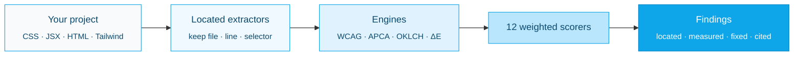

<picture>
  <source media="(prefers-color-scheme: dark)" srcset=".github/assets/logo-dark.svg">
  <source media="(prefers-color-scheme: light)" srcset=".github/assets/logo-light.svg">
  
</picture>

<p align="center">
  <a href="https://github.com/Aboudjem/ui-ux-suite/actions/workflows/ci.yml"></a>
  <a href="https://www.npmjs.com/package/ui-ux-suite"></a>
  <a href="LICENSE"></a>
  <a href="#real-tests"></a>
  <a href="https://nodejs.org"></a>
  <a href="#zero-dependencies"></a>
  <a href="https://github.com/Aboudjem/ui-ux-suite/stargazers"></a>
</p>

<p align="center">
  <a href="../README.md">English</a> ·
  <a href="zh-CN.md">简体中文</a> ·
  <b>日本語</b> ·
  <a href="es.md">Español</a> ·
  <a href="fr.md">Français</a>
</p>

<p align="center"><b>デザインのための ESLint。</b>正確な行、計測された誤った値、そして正確な修正方法を見つけ出します。</p>

<p align="center">
  <a href="#what-is-ui-ux-suite">これは何か</a> ·
  <a href="#how-to-use-it-3-steps">使い方</a> ·
  <a href="#real-beforeafter">ビフォー / アフター</a> ·
  <a href="#how-it-compares">比較</a> ·
  <a href="#faq">FAQ</a>
</p>

---


---

## ui-ux-suite とは？

**ui-ux-suite は依存ゼロのデザインリンターです。CSS、JSX、HTML、Tailwind 設定を監査し、一般論ではなく、具体的で、位置を特定し、計測した指摘を、確かな修正方法とともに返します。**

ほとんどの「デザインレビュー」ツールは *「コントラストを改善しましょう」* と言うだけです。本ツールはこう伝えます:

> `src/styles.css:14` の `.hero-subtitle`: テキスト `#fbfbfb` を `#ffffff` の上に置くと = **1.03:1** で、WCAG 2.2 AA（4.5:1 が必要）に不合格です。修正: `color` を `#767676`（白の上で 4.54:1）またはより暗い色に変更してください。

これこそが本質です。すべての指摘は **位置が特定され**（file:line + セレクタ）、**計測され**（実際の誤った数値）、**修正できます**（正確な変更）。**12 のデザイン次元** を **WCAG 2.2**、**APCA** コントラスト、そして **UX の法則** に基づいて採点し、依拠する WCAG 達成基準または名前付きの法則を引用します。

- **監査するだけで、決して編集しません。**すべての実行は読み取り専用で、提案を出力します（`before` → `after`）。修正を適用するかどうかはあなた次第です。
- **どこでも動きます。**1 つの MCP サーバー + 1 つの `npx` CLI → Claude Code、Cursor、VS Code、Codex、Gemini、Windsurf、Continue で動作します。
- **何も必要ありません。**純粋な Node の組み込みモジュールのみ。インストールの重さ、API キー、ネットワーク、テレメトリーは一切なし。あなたのコードはあなたのマシンにとどまります。

**実際の実行を見る:** [サンプル監査レポート](docs/demo/sample-audit.html) · [サンプルのターミナル出力](docs/demo/sample-run.txt)

<picture>
  <source media="(prefers-color-scheme: dark)" srcset=".github/assets/scorecard-dark.svg">
  <source media="(prefers-color-scheme: light)" srcset=".github/assets/scorecard-light.svg">
  
</picture>

---

## 使い方（3 ステップ）

### 1. 任意のプロジェクトで実行する

```bash
npx ui-ux-suite .
```

「位置を特定 + 計測 + 修正」した指摘の優先順位付きリストと、12 次元にわたる加重 0–10 のスコアが得られます。設定もセットアップも不要です。

### 2. 必要な出力を選ぶ

```bash
npx ui-ux-suite .                      # human-readable report (default)
npx ui-ux-suite . --json | jq          # machine-readable JSON (banner goes to stderr)
npx ui-ux-suite . --html report.html   # standalone dark-theme HTML report
npx ui-ux-suite . --fail-under 7        # exit 1 if the score drops below 7 (CI gate)
```

終了コード: `0` 正常 · `1` 監査エラーまたは `--fail-under` を下回る · `2` パスが見つからない · `3` 証拠不足。

### 3. AI エディタに組み込む（任意）

```bash
npx ui-ux-suite --mcp     # start the MCP server over stdio
```

その後、エディタに *「このプロジェクトのデザインを監査して」* と尋ねてください。MCP ツール `uiux_audit_run` は同じエンジンを実行し、同じ位置特定済みの指摘を返します。

<details>
<summary><b>エディタごとの 1 行 MCP 設定</b></summary>

```bash
# Claude Code
claude mcp add ui-ux-suite npx ui-ux-suite --mcp

# Codex CLI
codex mcp add ui-ux-suite -- npx -y ui-ux-suite --mcp
```

**Cursor**（`~/.cursor/mcp.json`）:
```json
{ "mcpServers": { "ui-ux-suite": { "command": "npx", "args": ["ui-ux-suite", "--mcp"] } } }
```

**VS Code + Copilot**（`.vscode/mcp.json`）:
```json
{ "servers": { "ui-ux-suite": { "command": "npx", "args": ["-y", "ui-ux-suite", "--mcp"] } } }
```

**Gemini CLI**（`~/.gemini/mcp_config.json`）:
```json
{ "mcpServers": { "ui-ux-suite": { "command": "npx", "args": ["ui-ux-suite", "--mcp"] } } }
```

**Windsurf**（`~/.codeium/windsurf/mcp_config.json`）:
```json
{ "mcpServers": { "ui-ux-suite": { "command": "npx", "args": ["ui-ux-suite", "--mcp"] } } }
```

**Continue.dev**（`.continue/mcpServers/ui-ux-suite.yaml`）:
```yaml
mcpServers:
  ui-ux-suite: { command: npx, args: [ui-ux-suite, --mcp], type: stdio }
```

</details>

### または任意の AI CLI にスキルをインストールする

上記の MCP サーバーは、MCP に対応したすべてのクライアントで動作します。`/design-*` スキルを別の CLI に直接読み込ませたい場合は、この 1 行のインストーラーを実行してください。スキルをその CLI のスキルディレクトリにシンボリックリンクします。`--update` は最新版を取得して再リンクし、`--uninstall` はそれらを削除します。

```bash
curl -fsSL https://raw.githubusercontent.com/Aboudjem/ui-ux-suite/main/install.sh | bash -s codex
```

Windows では、チェックアウトから `install.ps1 <platform>` を実行してください（シンボリックリンクの作成には開発者モードか昇格したシェルが必要です）。

| プラットフォーム | スキルディレクトリ | ワンライナー |
|:--|:--|:--|
| Claude Code | （プラグイン） | `claude plugin install ui-ux-suite@10x` |
| Codex / Gemini / OpenCode / Pi | `~/.agents/skills` | `install.sh codex` |
| VS Code (Copilot) | `~/.copilot/skills` | `install.sh copilot` |
| Trae | `~/.trae/skills` | `install.sh trae` |
| Vibe | `~/.vibe/skills` | `install.sh vibe` |
| OpenClaw | `~/.openclaw/skills` | `install.sh openclaw` |
| Antigravity | `~/.gemini/antigravity/skills` | `install.sh antigravity` |
| Hermes / Cline / Kimi | `~/.<cli>/skills` | `install.sh hermes` |

スキルディレクトリの慣習は CLI のリリースごとに変わります。リンクが解決しない場合は、MCP サーバーにフォールバックしてください（どこでも動作します）。`install.sh all` で全プラットフォームを一度にリンクできます。

<details>
<summary><b>Claude Code プラグインとしてインストール</b></summary>

```bash
# From the 10x marketplace
claude plugin marketplace add Aboudjem/10x
claude plugin install ui-ux-suite@10x
```

スラッシュコマンド、専門エージェント、ナレッジベース、そして MCP サーバーを 1 ステップで設定します。
</details>

<details>
<summary><b>開発依存としてインストール</b></summary>

```bash
npm install -D ui-ux-suite
```

```json
{ "scripts": { "design-audit": "ui-ux-suite . --fail-under 7" } }
```

Node 18+ が必要です。
</details>

---

## 実際のビフォー / アフター

リポジトリには、**意図的に仕込まれた 12 個の UX 問題** とその正解（`test/fixtures/planted-ux-problems/PLANTED.md`）を含むフィクスチャが同梱されています。これはすべてのリリースの回帰ゲートです。

今回の再構築で本当に変わったのは **具体性** です。すなわち、ある指摘が検出され、**かつ** 位置を特定し、**かつ** 計測し、**かつ** 修正されているか:

| | 検出 | 位置（`file:line`） | 計測（実際の値） | 修正（`before`→`after`） | 具体性 |
|:--|:--:|:--:|:--:|:--:|:--:|
| **以前（v0.3 ベースライン）** | 一部 | ✗ | ✗ | ✗ | **0 / 12** |
| **以後（v0.4）** | ✓ | ✓ | ✓ | ✓ | **12 / 12** |

旧エンジンはすべての CSS ファイルを 1 つの塊に連結し、裸の `{severity, msg}` 文字列を出力していました。ファイルの同一性は採点前に失われ、特定の行を指し示すことができませんでした。新エンジンは `{value, file, line, col, selector}` を抽出器から最終的な指摘まで一貫して運びます。

**そのフィクスチャからの実際の指摘**（`npx ui-ux-suite test/fixtures/planted-ux-problems` からの逐語）:

```
Low text contrast on `.hero-subtitle`: 1.03:1
  src/styles.css:14   ·   WCAG 1.4.3 Contrast (Minimum) (AA)
  measured: 1.03:1 (APCA Lc 0)
  fix: change color on `.hero-subtitle` from #fbfbfb to #767676
       (meets 4.5:1 on #ffffff), or darken further.
```

このフィクスチャは現在 **3.8 / 10（「要改善」）** のスコアです。なぜなら、それは壊れているべきだからです。ご自身で実行できます:

```bash
npx ui-ux-suite test/fixtures/planted-ux-problems
```

---

## 他ツールとの比較

差別化要因は、**位置を特定 + 計測 + 修正し、WCAG SC または UX の法則の引用を添え、ソースコード *または* URL から行うこと** を、すべてのエディタで 1 つの依存ゼロのコマンドで実現する点です。

| | ui-ux-suite | Lighthouse | axe-core | CSS / デザインリンター |
|:--|:--:|:--:|:--:|:--:|
| 正確な `file:line` + セレクタを指す | ✓ | ✗（URL のみ） | ✗（DOM ノードのみ） | ✓（lint ルール） |
| **計測した誤った値** を報告する | ✓ | 一部 | ✓（コントラスト） | ✗ |
| 具体的な `before` → `after` の修正を示す | ✓ | ✗ | ✗ | 一部（自動修正） |
| WCAG 2.2 **と** APCA を引用する | ✓ | WCAG のみ | WCAG のみ | ✗ |
| 名前付きの **UX の法則**（Hick、Fitts、Miller…）を引用する | ✓ | ✗ | ✗ | ✗ |
| **静的なソース** で動く（実行中の URL 不要） | ✓ | ✗（URL が必要） | ✗（DOM が必要） | ✓ |
| **実行中の URL** で動く（ディープモード） | ✓（オプトイン） | ✓ | ✓ | ✗ |
| **12 のデザイン次元** をカバー（a11y を超えて） | ✓ | 一部 | a11y のみ | ルール単位 |
| 実行時依存ゼロ | ✓ | ✗ | ✗ | ✗ |

ui-ux-suite は Lighthouse や axe を置き換えるものではありません。それらが残す隙間を埋めます。すなわち、あなたの **ソース** に基づくデザイン品質と、貼り付けられる修正です。

---

## 何を採点するか

12 の加重次元。アクセシビリティは最も多くのユーザーに影響するため、最大の重みを持ちます。

| 次元 | 重み | チェック項目 |
|:----------|:------:|:-------|
| アクセシビリティ | 12% | フォーカスの可視性、代替テキスト、ラベル、ターゲットサイズ、動きの低減 |
| カラーシステム | 10% | WCAG + APCA コントラスト、重複した色相、セマンティックな役割、ダークモード |
| タイポグラフィシステム | 10% | スケールの一貫性、フォント数、本文サイズ、行の高さ |
| レイアウトと余白 | 10% | グリッド、スケール外の値、ブレークポイント、コンテナ幅 |
| コンポーネント品質 | 10% | 状態: ホバー、フォーカス、無効、ローディング、エラー |
| 視覚的階層 | 10% | タイプスケール、情報の優先順位、走査しやすさ |
| インタラクション品質 | 8% | アニメーションのタイミング、イージング、フィードバック |
| レスポンシブ | 8% | ブレークポイント、コンテナクエリ、viewport メタ |
| ビジュアルの仕上げ | 7% | シャドウの品質、角丸トークン、スケール外の任意値 |
| パフォーマンス UX | 5% | ローディング状態、体感速度 |
| 情報アーキテクチャ | 5% | バリデーション、ナビゲーション、コマンドパレット |
| プラットフォーム適合 | 5% | ダークモード、コンポーネントライブラリ、a11y プリミティブ |

---

## 仕組み



静的解析がデフォルトであり、主要な成果物です。ブラウザは不要です。**ディープモード** はオプトインです。オプションの peer 依存（`playwright-core`、`@axe-core/playwright`）をインストールし、`baseUrl` を渡すと、実際のコントラストの計測、44×44px 未満のタップターゲットのフラグ付け、ルートのスクリーンショットも行えます。依存が存在しない場合は、ソースベースの指摘へと優雅に縮退します。

<details>
<summary><b>16 個の MCP ツール</b></summary>

| ツール | 機能 |
|:-----|:-------------|
| `uiux_audit_run` | **1 回の呼び出しで完全な監査。**スキャン → 抽出 → 12 次元を採点 → 位置特定済みの指摘。`depth: quick\|deep`、`dimensions`、`baseUrl`、`format` に対応。 |
| `uiux_scan_project` | フレームワーク、スタイリング（Tailwind v3 と v4）、コンポーネント/テーマ/アイコンのライブラリを検出。 |
| `uiux_extract_colors` / `uiux_extract_typography` / `uiux_extract_spacing` | 値を file/line/selector **付きで** 抽出。 |
| `uiux_check_contrast` | 任意の組み合わせの WCAG 2.2 + APCA コントラスト。 |
| `uiux_score_dimension` / `uiux_score_overall` | 12 次元のいずれか 1 つ、または加重合計を採点。 |
| `uiux_generate_palette` / `uiux_generate_type_scale` / `uiux_generate_spacing_scale` / `uiux_generate_tokens` | OKLCH ベースのトークン生成器。 |
| `uiux_knowledge_query` / `uiux_laws_query` | ナレッジベースと UX の法則を照会。 |
| `uiux_audit_log` / `uiux_audit_report` | 指摘を追記 · レポートをレンダリング。 |

</details>

<details>
<summary><b>スラッシュコマンド（Claude Code）</b></summary>

```
/ui-ux-suite:audit          Full 12-dimension audit, one report
/ui-ux-suite:colors         Color-only audit
/ui-ux-suite:a11y [--deep]  Accessibility audit (Playwright + axe-core in deep mode)
/ui-ux-suite:typography     Typography and hierarchy audit
/ui-ux-suite:components     Component-quality audit
```

さらに 14 個の専門的な `/design-*`、`/color-audit`、`/a11y-audit`、… コマンドと 12 個の専門エージェントがあります。
</details>

---

## FAQ

**自分のプロジェクトで実行しても安全ですか？**
はい。すべての監査は厳密に読み取り専用です。本ツールは監査対象のプロジェクトでファイルを作成・編集・削除することはありません。読み取って報告するだけです。ディープモードのスクリーンショットは使い捨てのブラウザページで行われ、あなたのソースに対しては決して行われません。

**コードはマシンの外に出ますか？**
いいえ。すべての解析は Node の組み込みモジュールでローカルに実行されます。ネットワーク呼び出し、API キー、テレメトリーはありません。

**どのフレームワークに対応していますか？**
React、Next.js、Vue、Svelte、Angular、そしてバニラ。スタイリング: Tailwind（v3 と v4 `@theme`）、CSS Modules、SCSS、styled-components、Emotion、vanilla-extract、プレーン CSS。スタックを自動検出します。設定は不要です。

**<a id="zero-dependencies"></a>本当に依存ゼロですか？**
はい。ランタイムは Node の組み込みモジュールのみを使用します。`playwright-core` と `@axe-core/playwright` はディープモード専用の **オプション** の peer 依存で、デフォルトのインストールでは何も取得しません。

**実行中のアプリは必要ですか？**
いいえ。ソースベースの指摘がデフォルトです。実行中の URL とディープモードはおまけであり、必須ではありません。

**コードを自動で修正しますか？**
いいえ。監査して*提案する*（`before` → `after`）だけです。修正の適用は、あなたが別途意図して行う一歩です。

**CI で使えますか？**
はい。`npx ui-ux-suite . --fail-under 7` は、スコアがしきい値を下回ると非ゼロで終了します。`--json` は任意のパイプライン向けに機械可読な出力を提供します。

---

## なぜ信頼できるのか

- **本物の色彩科学。**コントラストはツール自身の WCAG 2.2 と APCA の計算で求められ、推定ではありません。フィクスチャの計測比率（例: `1.03:1`）は `lib/color-engine.js` から再現できます。
- **WCAG 達成基準の引用。**アクセシビリティの指摘は正確な SC を引用します: `1.4.3` コントラスト（最低限）、`1.4.11` 非テキストのコントラスト、`2.5.8` ターゲットのサイズ、`2.4.7` フォーカスの可視化、`1.1.1` 非テキストコンテンツ、`3.3.2` ラベルまたは説明。
- **検証済みの UX の法則。**UX の指摘は一次資料の許可リストにある名前付きの法則を引用し、それぞれが [lawsofux.com](https://lawsofux.com/) の正式なページにリンクします（例: Hick の法則、Fitts の法則、Prägnanz の法則）。誤った引用は引用が無いことより悪いと見なされるため、引用集合はテストで固定されています。
- <a id="real-tests"></a>**雰囲気ではなく回帰ゲート。** **311 個のテスト**（`npm test` で実行）が実際の動作を断言します。これには、すべての指摘が `evidence.file`、`evidence.line`、そして `fix` を持つ必要がある 12 問題のフィクスチャが含まれます。具体性が後退すると、テストスイートは失敗します。

---

## プライバシー

すべての解析はローカルで実行されます。あなたのコードがマシンの外に出ることはありません。テレメトリー、API 呼び出し、ネットワークは一切ありません。

---

## Star の履歴

<a href="https://star-history.com/#Aboudjem/ui-ux-suite&Date">
  <picture>
    <source media="(prefers-color-scheme: dark)" srcset="https://api.star-history.com/svg?repos=Aboudjem/ui-ux-suite&type=Date&theme=dark" />
    <source media="(prefers-color-scheme: light)" srcset="https://api.star-history.com/svg?repos=Aboudjem/ui-ux-suite&type=Date" />
    
  </picture>
</a>

---

## コントリビュート

Issue と PR を歓迎します。本プロジェクトは公開で保守されています。

```bash
git clone https://github.com/Aboudjem/ui-ux-suite
cd ui-ux-suite
npm test
```

- **バグ修正** には、そのバグを捕捉できたであろうテストを含めてください。
- **新しい採点ルール** は、WCAG SC または許可リストの名前付き UX 法則を引用し、`evidence: {file, line, selector, measured, threshold}` と `fix` を備えた `createFinding(...)` を発行する必要があります。
- **新しい実行時依存を追加しないこと。**本スイートは設計上、依存ゼロです。
- ユーザー向けの文章では **ダッシュ（em-dash）を使わないこと**。

[CONTRIBUTING.md](CONTRIBUTING.md)、[AGENTS.md](AGENTS.md)、[CODE_OF_CONDUCT.md](CODE_OF_CONDUCT.md)、[SECURITY.md](SECURITY.md) を参照してください。

---

<p align="center">
  <a href="https://www.linkedin.com/in/adam-boudjemaa/"></a>
  <a href="https://x.com/AdamBoudj"></a>
  <a href="https://adam-boudjemaa.com/"></a>
</p>

<p align="center"><sub>MIT · <a href="https://github.com/Aboudjem">Adam Boudjemaa</a> が制作 · Star ⭐ を付けて他の人が見つけやすくしてください</sub></p>

> この翻訳は機械支援によるものです。英語版 README を基準に、母語話者による修正を歓迎します。
