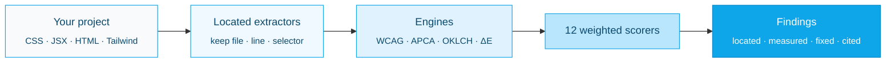

<picture>
  <source media="(prefers-color-scheme: dark)" srcset=".github/assets/logo-dark.svg">
  <source media="(prefers-color-scheme: light)" srcset=".github/assets/logo-light.svg">
  
</picture>

<p align="center">
  <a href="https://github.com/Aboudjem/ui-ux-suite/actions/workflows/ci.yml"></a>
  <a href="https://www.npmjs.com/package/ui-ux-suite"></a>
  <a href="LICENSE"></a>
  <a href="#real-tests"></a>
  <a href="https://nodejs.org"></a>
  <a href="#zero-dependencies"></a>
  <a href="https://github.com/Aboudjem/ui-ux-suite/stargazers"></a>
</p>

<p align="center">
  <a href="../README.md">English</a> ·
  <b>简体中文</b> ·
  <a href="ja.md">日本語</a> ·
  <a href="es.md">Español</a> ·
  <a href="fr.md">Français</a>
</p>

<p align="center"><b>面向设计的 ESLint。</b>它能找出确切的行、量化出错的数值，以及确切的修复方法。</p>

<p align="center">
  <a href="#what-is-ui-ux-suite">这是什么</a> ·
  <a href="#how-to-use-it-3-steps">如何使用</a> ·
  <a href="#real-beforeafter">修复前 / 修复后</a> ·
  <a href="#how-it-compares">对比</a> ·
  <a href="#faq">常见问题</a>
</p>

---


---

## ui-ux-suite 是什么？

**ui-ux-suite 是一个零依赖的设计检查工具，它会审计你的 CSS、JSX、HTML 和 Tailwind 配置，并返回具体的、定位到位置的、量化的发现，附带可落地的修复方案，而不是泛泛的建议。**

大多数“设计评审”工具只会告诉你 *“提高你的对比度”*。而本工具会告诉你：

> `.hero-subtitle`（位于 `src/styles.css:14`）：文本 `#fbfbfb` 在 `#ffffff` 之上 = **1.03:1**，不符合 WCAG 2.2 AA（需要 4.5:1）。修复：将 `color` 改为 `#767676`（在白色上为 4.54:1）或更深的颜色。

这正是关键所在。每一条发现都是**定位的**（file:line + 选择器）、**量化的**（真实的错误数值）和**可修复的**（确切的改动）。它评分 **12 个设计维度**，以 **WCAG 2.2**、**APCA** 对比度和 **UX 法则** 为依据，并引用其所依赖的 WCAG 成功标准或具名法则。

- **它只审计，从不修改。**每次运行都是只读的，并输出修改建议（`before` → `after`）。是否应用修复由你决定。
- **它可在任何地方运行。**一个 MCP 服务器 + 一个 `npx` CLI → 可在 Claude Code、Cursor、VS Code、Codex、Gemini、Windsurf 和 Continue 中使用。
- **它无需任何依赖。**纯 Node 内置模块。没有安装负担、没有 API 密钥、没有网络请求、没有遥测。你的代码留在你自己的机器上。

**查看真实运行结果：** [示例审计报告](docs/demo/sample-audit.html) · [示例终端输出](docs/demo/sample-run.txt)

<picture>
  <source media="(prefers-color-scheme: dark)" srcset=".github/assets/scorecard-dark.svg">
  <source media="(prefers-color-scheme: light)" srcset=".github/assets/scorecard-light.svg">
  
</picture>

---

## 如何使用（3 步）

### 1. 在任意项目上运行

```bash
npx ui-ux-suite .
```

你会得到一份按优先级排列的“定位 + 量化 + 修复”发现清单，以及一个跨 12 个维度的加权 0–10 分。无需配置，无需安装设置。

### 2. 选择你需要的输出

```bash
npx ui-ux-suite .                      # human-readable report (default)
npx ui-ux-suite . --json | jq          # machine-readable JSON (banner goes to stderr)
npx ui-ux-suite . --html report.html   # standalone dark-theme HTML report
npx ui-ux-suite . --fail-under 7        # exit 1 if the score drops below 7 (CI gate)
```

退出码：`0` 正常 · `1` 审计错误或低于 `--fail-under` · `2` 路径未找到 · `3` 证据不足。

### 3. 接入你的 AI 编辑器（可选）

```bash
npx ui-ux-suite --mcp     # start the MCP server over stdio
```

然后对你的编辑器说：*“审计这个项目的设计。”* MCP 工具 `uiux_audit_run` 运行的是同一个引擎，并返回相同的定位发现。

<details>
<summary><b>各编辑器的一行式 MCP 配置</b></summary>

```bash
# Claude Code
claude mcp add ui-ux-suite npx ui-ux-suite --mcp

# Codex CLI
codex mcp add ui-ux-suite -- npx -y ui-ux-suite --mcp
```

**Cursor**（`~/.cursor/mcp.json`）：
```json
{ "mcpServers": { "ui-ux-suite": { "command": "npx", "args": ["ui-ux-suite", "--mcp"] } } }
```

**VS Code + Copilot**（`.vscode/mcp.json`）：
```json
{ "servers": { "ui-ux-suite": { "command": "npx", "args": ["-y", "ui-ux-suite", "--mcp"] } } }
```

**Gemini CLI**（`~/.gemini/mcp_config.json`）：
```json
{ "mcpServers": { "ui-ux-suite": { "command": "npx", "args": ["ui-ux-suite", "--mcp"] } } }
```

**Windsurf**（`~/.codeium/windsurf/mcp_config.json`）：
```json
{ "mcpServers": { "ui-ux-suite": { "command": "npx", "args": ["ui-ux-suite", "--mcp"] } } }
```

**Continue.dev**（`.continue/mcpServers/ui-ux-suite.yaml`）：
```yaml
mcpServers:
  ui-ux-suite: { command: npx, args: [ui-ux-suite, --mcp], type: stdio }
```

</details>

### 或者将技能安装进任意 AI CLI

上面的 MCP 服务器可在每一个支持 MCP 的客户端中工作。若想把 `/design-*` 技能直接加载进另一个 CLI，运行这个一行式安装脚本。它会把技能软链接到该 CLI 的技能目录；`--update` 拉取最新版本并重新链接，`--uninstall` 移除它们。

```bash
curl -fsSL https://raw.githubusercontent.com/Aboudjem/ui-ux-suite/main/install.sh | bash -s codex
```

在 Windows 上，从一个本地检出运行 `install.ps1 <platform>`（创建软链接需要开启开发者模式或使用提升权限的 shell）。

| 平台 | 技能目录 | 一行命令 |
|:--|:--|:--|
| Claude Code | （插件） | `claude plugin install ui-ux-suite@10x` |
| Codex / Gemini / OpenCode / Pi | `~/.agents/skills` | `install.sh codex` |
| VS Code (Copilot) | `~/.copilot/skills` | `install.sh copilot` |
| Trae | `~/.trae/skills` | `install.sh trae` |
| Vibe | `~/.vibe/skills` | `install.sh vibe` |
| OpenClaw | `~/.openclaw/skills` | `install.sh openclaw` |
| Antigravity | `~/.gemini/antigravity/skills` | `install.sh antigravity` |
| Hermes / Cline / Kimi | `~/.<cli>/skills` | `install.sh hermes` |

技能目录约定会随 CLI 版本变化。若某个链接无法解析，请回退到 MCP 服务器（它在任何地方都能工作）。运行 `install.sh all` 可一次性链接所有平台。

<details>
<summary><b>作为 Claude Code 插件安装</b></summary>

```bash
# From the 10x marketplace
claude plugin marketplace add Aboudjem/10x
claude plugin install ui-ux-suite@10x
```

一步即可接好斜杠命令、专家智能体、知识库和 MCP 服务器。
</details>

<details>
<summary><b>作为开发依赖安装</b></summary>

```bash
npm install -D ui-ux-suite
```

```json
{ "scripts": { "design-audit": "ui-ux-suite . --fail-under 7" } }
```

需要 Node 18+。
</details>

---

## 真实的修复前 / 修复后

仓库附带了一个夹具，内含 **12 个刻意植入的 UX 问题** 及其标准答案（`test/fixtures/planted-ux-problems/PLANTED.md`）。它是每次发布的回归门禁。

这次重写中真正改变的是**具体性**：一条发现是否被检测到 **并且** 被定位 **并且** 被量化 **并且** 被修复：

| | 检测到 | 定位（`file:line`） | 量化（真实数值） | 修复（`before`→`after`） | 具体性 |
|:--|:--:|:--:|:--:|:--:|:--:|
| **之前（v0.3 基线）** | 部分 | ✗ | ✗ | ✗ | **0 / 12** |
| **之后（v0.4）** | ✓ | ✓ | ✓ | ✓ | **12 / 12** |

旧引擎把每个 CSS 文件拼接成一整块，并只发出裸的 `{severity, msg}` 字符串；文件身份在评分之前就丢失了，因此它永远无法指向某一行。新引擎将 `{value, file, line, col, selector}` 从提取器一路携带到最终发现。

**来自该夹具的真实发现**（逐字摘自 `npx ui-ux-suite test/fixtures/planted-ux-problems`）：

```
Low text contrast on `.hero-subtitle`: 1.03:1
  src/styles.css:14   ·   WCAG 1.4.3 Contrast (Minimum) (AA)
  measured: 1.03:1 (APCA Lc 0)
  fix: change color on `.hero-subtitle` from #fbfbfb to #767676
       (meets 4.5:1 on #ffffff), or darken further.
```

该夹具目前得分为 **3.8 / 10（“需要改进”）**，因为它本就应当是有缺陷的。你可以自己运行：

```bash
npx ui-ux-suite test/fixtures/planted-ux-problems
```

---

## 它如何与其他工具对比

差异点在于：**定位 + 量化 + 修复，并附带 WCAG SC 或 UX 法则引用，来自你的源代码 *或* 一个 URL**，在每个编辑器中用一条零依赖命令完成。

| | ui-ux-suite | Lighthouse | axe-core | CSS / 设计检查工具 |
|:--|:--:|:--:|:--:|:--:|
| 指向确切的 `file:line` + 选择器 | ✓ | ✗（仅 URL） | ✗（仅 DOM 节点） | ✓（lint 规则） |
| 报告**量化的错误数值** | ✓ | 部分 | ✓（对比度） | ✗ |
| 给出可落地的 `before` → `after` 修复 | ✓ | ✗ | ✗ | 部分（自动修复） |
| 同时引用 WCAG 2.2 **和** APCA | ✓ | 仅 WCAG | 仅 WCAG | ✗ |
| 引用具名的 **UX 法则**（Hick、Fitts、Miller…） | ✓ | ✗ | ✗ | ✗ |
| 在**静态源代码**上工作（无需运行中的 URL） | ✓ | ✗（需要 URL） | ✗（需要 DOM） | ✓ |
| 在**运行中的 URL** 上工作（深度模式） | ✓（可选启用） | ✓ | ✓ | ✗ |
| 覆盖 **12 个设计维度**（不止可访问性） | ✓ | 部分 | 仅 a11y | 按规则 |
| 零运行时依赖 | ✓ | ✗ | ✗ | ✗ |

ui-ux-suite 并不取代 Lighthouse 或 axe。它填补它们留下的空白：以你的**源代码**为依据的设计质量，附带你可以直接粘贴的修复。

---

## 它评分什么

12 个加权维度。可访问性权重最高，因为它影响最多的用户。

| 维度 | 权重 | 检查项 |
|:----------|:------:|:-------|
| 可访问性 | 12% | 焦点可见、替代文本、标签、目标尺寸、减少动效 |
| 色彩系统 | 10% | WCAG + APCA 对比度、重复色相、语义角色、暗色模式 |
| 排版系统 | 10% | 比例一致性、字体数量、正文尺寸、行高 |
| 布局与间距 | 10% | 网格、偏离比例的数值、断点、容器宽度 |
| 组件质量 | 10% | 状态：悬停、焦点、禁用、加载、错误 |
| 视觉层级 | 10% | 字号比例、信息优先级、可扫读性 |
| 交互质量 | 8% | 动画时长、缓动、反馈 |
| 响应式 | 8% | 断点、容器查询、viewport meta |
| 视觉精修 | 7% | 阴影质量、圆角令牌、偏离比例的任意值 |
| 性能体验 | 5% | 加载状态、感知速度 |
| 信息架构 | 5% | 校验、导航、命令面板 |
| 平台适配 | 5% | 暗色模式、组件库、a11y 原语 |

---

## 它如何工作



静态分析是默认模式，也是主要交付物；它无需浏览器。**深度模式**为可选启用：安装可选的 peer 依赖（`playwright-core`、`@axe-core/playwright`）并传入一个 `baseUrl`，即可额外测量实时对比度、标记小于 44×44px 的触控目标，并对路由截图。当这些依赖缺失时，它会优雅地退化为基于源代码的发现。

<details>
<summary><b>16 个 MCP 工具</b></summary>

| 工具 | 作用 |
|:-----|:-------------|
| `uiux_audit_run` | **一次调用完成完整审计。**扫描 → 提取 → 评分 12 个维度 → 定位发现。支持 `depth: quick\|deep`、`dimensions`、`baseUrl`、`format`。 |
| `uiux_scan_project` | 检测框架、样式方案（Tailwind v3 与 v4）、组件/主题/图标库。 |
| `uiux_extract_colors` / `uiux_extract_typography` / `uiux_extract_spacing` | 提取数值，**并附带** file/line/selector。 |
| `uiux_check_contrast` | 对任意一对颜色计算 WCAG 2.2 + APCA 对比度。 |
| `uiux_score_dimension` / `uiux_score_overall` | 对 12 个维度之一评分，或给出加权总分。 |
| `uiux_generate_palette` / `uiux_generate_type_scale` / `uiux_generate_spacing_scale` / `uiux_generate_tokens` | 基于 OKLCH 的令牌生成器。 |
| `uiux_knowledge_query` / `uiux_laws_query` | 查询知识库与 UX 法则。 |
| `uiux_audit_log` / `uiux_audit_report` | 追加一条发现 · 渲染一份报告。 |

</details>

<details>
<summary><b>斜杠命令（Claude Code）</b></summary>

```
/ui-ux-suite:audit          Full 12-dimension audit, one report
/ui-ux-suite:colors         Color-only audit
/ui-ux-suite:a11y [--deep]  Accessibility audit (Playwright + axe-core in deep mode)
/ui-ux-suite:typography     Typography and hierarchy audit
/ui-ux-suite:components     Component-quality audit
```

另外还有 14 个专家级 `/design-*`、`/color-audit`、`/a11y-audit`、… 命令以及 12 个专家智能体。
</details>

---

## 常见问题

**在我的项目上运行安全吗？**
安全。每次审计都是严格只读的。本工具绝不会在你审计的项目中创建、修改或删除文件；它只读取并报告。深度模式的截图发生在一个用完即弃的浏览器页面里，绝不针对你的源代码。

**我的代码会离开我的机器吗？**
不会。所有分析都在本地使用 Node 内置模块运行。没有网络请求、没有 API 密钥、没有遥测。

**它支持哪些框架？**
React、Next.js、Vue、Svelte、Angular 和原生。样式方案：Tailwind（v3 与 v4 `@theme`）、CSS Modules、SCSS、styled-components、Emotion、vanilla-extract、纯 CSS。它会自动检测技术栈；无需配置。

**<a id="zero-dependencies"></a>它真的是零依赖吗？**
是的。运行时只使用 Node 内置模块。`playwright-core` 和 `@axe-core/playwright` 是**可选**的 peer 依赖，仅用于深度模式；默认安装不会拉取任何东西。

**我需要一个运行中的应用吗？**
不需要。基于源代码的发现是默认模式。一个运行中的 URL 加深度模式是加分项，而非必需。

**它会自动修复我的代码吗？**
不会。它只审计并*建议*（`before` → `after`）。应用修复是你单独、有意采取的一步。

**我能在 CI 中使用吗？**
能。`npx ui-ux-suite . --fail-under 7` 会在得分低于你的阈值时以非零退出码退出。`--json` 为任何流水线提供机器可读的输出。

---

## 为什么可以信任它

- **真实的色彩科学。**对比度由工具自带的 WCAG 2.2 与 APCA 数学计算得出，而非估算。夹具中量化的比值（例如 `1.03:1`）可从 `lib/color-engine.js` 复现。
- **引用 WCAG 成功标准。**可访问性发现会引用确切的 SC：`1.4.3` 对比度（最低）、`1.4.11` 非文本对比度、`2.5.8` 目标尺寸、`2.4.7` 焦点可见、`1.1.1` 非文本内容、`3.3.2` 标签或说明。
- **经过核实的 UX 法则。**UX 发现引用来自首要来源白名单的具名法则，每条都链接到其在 [lawsofux.com](https://lawsofux.com/) 上的规范页面（例如 Hick 法则、Fitts 法则、Prägnanz 法则）。错误的引用被视为比没有引用更糟，因此引用集合由一项测试固定。
- <a id="real-tests"></a>**这是回归门禁，而不是凭感觉。** **311 项测试**（运行 `npm test`）断言真实行为，其中包含一个 12 问题夹具，要求每条发现都必须携带 `evidence.file`、`evidence.line` 和一个 `fix`。如果具体性出现倒退，测试套件就会失败。

---

## 隐私

所有分析都在本地运行。你的代码绝不离开你的机器。没有遥测、没有 API 调用、没有网络请求。

---

## Star 历史

<a href="https://star-history.com/#Aboudjem/ui-ux-suite&Date">
  <picture>
    <source media="(prefers-color-scheme: dark)" srcset="https://api.star-history.com/svg?repos=Aboudjem/ui-ux-suite&type=Date&theme=dark" />
    <source media="(prefers-color-scheme: light)" srcset="https://api.star-history.com/svg?repos=Aboudjem/ui-ux-suite&type=Date" />
    
  </picture>
</a>

---

## 参与贡献

欢迎贡献。本项目公开维护。

```bash
git clone https://github.com/Aboudjem/ui-ux-suite
cd ui-ux-suite
npm test
```

- **缺陷修复**应附带一项原本能捕获该缺陷的测试。
- **新的评分规则**必须引用一个 WCAG SC 或白名单中的具名 UX 法则，并发出一个带 `evidence: {file, line, selector, measured, threshold}` 以及一个 `fix` 的 `createFinding(...)`。
- **不引入新的运行时依赖。**本套件按设计即为零依赖。
- 面向用户的文案中**不使用破折号（em-dash）**。

参见 [CONTRIBUTING.md](CONTRIBUTING.md)、[AGENTS.md](AGENTS.md)、[CODE_OF_CONDUCT.md](CODE_OF_CONDUCT.md) 和 [SECURITY.md](SECURITY.md)。

---

<p align="center">
  <a href="https://www.linkedin.com/in/adam-boudjemaa/"></a>
  <a href="https://x.com/AdamBoudj"></a>
  <a href="https://adam-boudjemaa.com/"></a>
</p>

<p align="center"><sub>MIT · 由 <a href="https://github.com/Aboudjem">Adam Boudjemaa</a> 构建 · 点个 Star ⭐ 帮助更多人发现它</sub></p>

> 本译文由机器辅助翻译，欢迎以英文版 README 为准提交母语修订。
